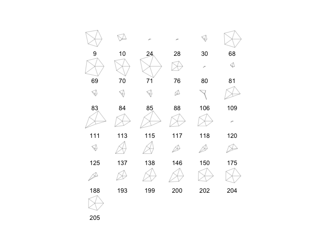
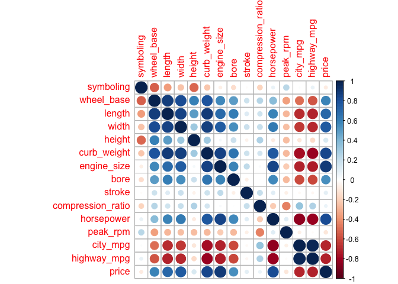

hw01-Betty-Cui.Rmd
================
Betty Cui
2/18/2018

### Data Dictionary (To build a data dictionary in a separated text file)

cd Desktop/stats133
mkdir hw01
cd hw01
mkdir imports-85-dictionary.md

``` r
## Data Import
column_names <- c("symboling","normalized_losses","make","fuel_type","aspiration","num_of_doors","body_style","drive_wheel", "engine_location", "wheel_base", "length","width","height", "curb_weight", "engine_type", "num_of_cylinders", "engine_size", "fuel_system", "bore", "stroke", "compression_ratio", "horsepower", "peak_rpm", "city_mpg", "highway_mpg", "price")

classes <- c( "real","character","character", "character", "character", "character","character", "character", "character", "real","real","real", "real", "integer", "character", "character", "integer", "character", "real", "real", "real", "integer", "integer", "integer","integer", "integer")


library(readr)
dat <- data.frame(
  read_csv("./imports-85.data",
           col_types = cols(symboling = col_double(),
                            normalized.losses = col_character(), 
                            make = col_character(), 
                            fuel_type = col_character(), 
                            aspiration = col_character(), 
                            num_of_doors = col_character(), 
                            body_style = col_character(), 
                            drive_wheel = col_character(), 
                            engine_location = col_character(), 
                            wheel_base = col_double(), 
                            length = col_double(), 
                            width = col_double(), 
                            height = col_double(), 
                            curb_weight = col_integer(), 
                            engine_type = col_character(), 
                            num_of_cylinders = col_character(), 
                            engine_size = col_integer(), 
                            fuel_system = col_character(), 
                            bore = col_double(), 
                            stroke = col_double(), 
                            compression_ratio = col_double(), 
                            horsepower = col_integer(), 
                            peak_rpm = col_integer(), 
                            city_mpg = col_integer(), 
                            highway_mpg = col_integer(), 
                            price = col_integer())
           )
  )
```

    ## Warning: The following named parsers don't match the column names:
    ## symboling, normalized.losses, make, fuel_type, aspiration, num_of_doors,
    ## body_style, drive_wheel, engine_location, wheel_base, length, width,
    ## height, curb_weight, engine_type, num_of_cylinders, engine_size,
    ## fuel_system, bore, stroke, compression_ratio, horsepower, peak_rpm,
    ## city_mpg, highway_mpg, price

``` r
str(dat)
```

    ## 'data.frame':    204 obs. of  26 variables:
    ##  $ X3         : int  3 1 2 2 2 1 1 1 0 2 ...
    ##  $ X.         : chr  "?" "?" "164" "164" ...
    ##  $ alfa.romero: chr  "alfa-romero" "alfa-romero" "audi" "audi" ...
    ##  $ gas        : chr  "gas" "gas" "gas" "gas" ...
    ##  $ std        : chr  "std" "std" "std" "std" ...
    ##  $ two        : chr  "two" "two" "four" "four" ...
    ##  $ convertible: chr  "convertible" "hatchback" "sedan" "sedan" ...
    ##  $ rwd        : chr  "rwd" "rwd" "fwd" "4wd" ...
    ##  $ front      : chr  "front" "front" "front" "front" ...
    ##  $ X88.60     : num  88.6 94.5 99.8 99.4 99.8 ...
    ##  $ X168.80    : num  169 171 177 177 177 ...
    ##  $ X64.10     : num  64.1 65.5 66.2 66.4 66.3 71.4 71.4 71.4 67.9 64.8 ...
    ##  $ X48.80     : num  48.8 52.4 54.3 54.3 53.1 55.7 55.7 55.9 52 54.3 ...
    ##  $ X2548      : int  2548 2823 2337 2824 2507 2844 2954 3086 3053 2395 ...
    ##  $ dohc       : chr  "dohc" "ohcv" "ohc" "ohc" ...
    ##  $ four       : chr  "four" "six" "four" "five" ...
    ##  $ X130       : int  130 152 109 136 136 136 136 131 131 108 ...
    ##  $ mpfi       : chr  "mpfi" "mpfi" "mpfi" "mpfi" ...
    ##  $ X3.47      : chr  "3.47" "2.68" "3.19" "3.19" ...
    ##  $ X2.68      : chr  "2.68" "3.47" "3.40" "3.40" ...
    ##  $ X9.00      : num  9 9 10 8 8.5 8.5 8.5 8.3 7 8.8 ...
    ##  $ X111       : chr  "111" "154" "102" "115" ...
    ##  $ X5000      : chr  "5000" "5000" "5500" "5500" ...
    ##  $ X21        : int  21 19 24 18 19 19 19 17 16 23 ...
    ##  $ X27        : int  27 26 30 22 25 25 25 20 22 29 ...
    ##  $ X13495     : chr  "16500" "16500" "13950" "17450" ...

``` r
dat <- read.csv("imports-85.data",header = FALSE, col.names = column_names, colClasses = classes, na.strings="?",  stringsAsFactors = FALSE)
str(dat)
```

    ## 'data.frame':    205 obs. of  26 variables:
    ##  $ symboling        : num  3 3 1 2 2 2 1 1 1 0 ...
    ##  $ normalized_losses: chr  NA NA NA "164" ...
    ##  $ make             : chr  "alfa-romero" "alfa-romero" "alfa-romero" "audi" ...
    ##  $ fuel_type        : chr  "gas" "gas" "gas" "gas" ...
    ##  $ aspiration       : chr  "std" "std" "std" "std" ...
    ##  $ num_of_doors     : chr  "two" "two" "two" "four" ...
    ##  $ body_style       : chr  "convertible" "convertible" "hatchback" "sedan" ...
    ##  $ drive_wheel      : chr  "rwd" "rwd" "rwd" "fwd" ...
    ##  $ engine_location  : chr  "front" "front" "front" "front" ...
    ##  $ wheel_base       : num  88.6 88.6 94.5 99.8 99.4 ...
    ##  $ length           : num  169 169 171 177 177 ...
    ##  $ width            : num  64.1 64.1 65.5 66.2 66.4 66.3 71.4 71.4 71.4 67.9 ...
    ##  $ height           : num  48.8 48.8 52.4 54.3 54.3 53.1 55.7 55.7 55.9 52 ...
    ##  $ curb_weight      : int  2548 2548 2823 2337 2824 2507 2844 2954 3086 3053 ...
    ##  $ engine_type      : chr  "dohc" "dohc" "ohcv" "ohc" ...
    ##  $ num_of_cylinders : chr  "four" "four" "six" "four" ...
    ##  $ engine_size      : int  130 130 152 109 136 136 136 136 131 131 ...
    ##  $ fuel_system      : chr  "mpfi" "mpfi" "mpfi" "mpfi" ...
    ##  $ bore             : num  3.47 3.47 2.68 3.19 3.19 3.19 3.19 3.19 3.13 3.13 ...
    ##  $ stroke           : num  2.68 2.68 3.47 3.4 3.4 3.4 3.4 3.4 3.4 3.4 ...
    ##  $ compression_ratio: num  9 9 9 10 8 8.5 8.5 8.5 8.3 7 ...
    ##  $ horsepower       : int  111 111 154 102 115 110 110 110 140 160 ...
    ##  $ peak_rpm         : int  5000 5000 5000 5500 5500 5500 5500 5500 5500 5500 ...
    ##  $ city_mpg         : int  21 21 19 24 18 19 19 19 17 16 ...
    ##  $ highway_mpg      : int  27 27 26 30 22 25 25 25 20 22 ...
    ##  $ price            : int  13495 16500 16500 13950 17450 15250 17710 18920 23875 NA ...

### 3 Technical Questions about importing data

1.  The column name is used as column names and the real data values starts from the second line.
2.  Since the header is set to False, the first line(column names) will be considered as data value.
3.  Each data type will be factor.
4.  Because on the first option, we specify the column type which requires more storage.
5.  It is going to convert to three columns, one column is value, one is variable name, and another one is data(index)

``` r
## Colored Historgram of Price
colors <- c("yellow", "red", "black", "green", "violet", "orange", "blue", "pink", "cyan")
hist(dat$price, col = colors)
```


``` r
## Boxplot of horsepower in horizontal orientation
horsepower <- dat$horsepower
boxplot(horsepower, horizontal = TRUE)
```


``` r
## Barplot of frequencies if body_style in decreasing order
body_style <- dat$body_style
body_style <- table(body_style)
barplot(sort(body_style, decreasing = TRUE))
```


``` r
colnames <- c("wheel_base", "length", "width", "height", "price")
turbo1 <- dat[dat$aspiration == 'turbo' , colnames]
stars(turbo1, key.labels = colnames)
```



``` r
## Summaries
#a) Mean price of fuel_type gas car
fuel <- dat$fuel_type
total <- aggregate(dat$price, by = list(fuel), mean, na.rm = TRUE)
total
```

    ##   Group.1        x
    ## 1  diesel 15838.15
    ## 2     gas 12916.41

``` r
#b) make of twelve num_of_cylinders 
make <- dat$make[dat$num_of_cylinders == "twelve"]
make
```

    ## [1] "jaguar"

``` r
#c) make that has most diesel car
make1 <- dat$make[dat$fuel_type == "diesel"]
count_frequency <- sort(table(make1), decreasing = TRUE)
new_make <- names(count_frequency[1])
new_make
```

    ## [1] "peugot"

``` r
#d) price of the car with largest hoursepower
price <- dat$price[dat$horsepower]
price
```

    ##   [1] 13860 13860  6918 13499 17075 12440 12440 12440  7053  7788  9549
    ##  [12]  9549  6229  6229  6229 15750 15750 15750 32250 28176 28176 25552
    ##  [23] 25552 13499 25552 25552 25552 13499  9279  9233 13645 16503  8845
    ##  [34] 16503 16503 16503 16503  6989  6989  6989  6989  9549  8949  6189
    ##  [45] 28176 28176  5499  9988  9988    NA 25552 25552 25552 25552 25552
    ##  [56]  9549  9549  9549 15040 14869 14869 14869 14869 10795 14869  7957
    ##  [67] 34184  7609  7609  7609  7609  7898  7898  7975  7975 10698 25552
    ##  [78] 25552 25552 13499 16630  9279  9233  9233  9233  9279  9279 16630
    ##  [89] 16630 28248  7395 28248 28248 28248 28248 28248 28248 28248 28248
    ## [100]  7499  7499  6338  6338  6338  7788 18950  7788  7499  7299  7499
    ## [111]  7299  7299  7299  7299  7299  7499  7299  7126 25552 13499 25552
    ## [122] 25552 25552  9279  9233  7775    NA    NA    NA    NA    NA    NA
    ## [133] 12440 12440 12440 12440  7788  7788 28248 35056 35056  8499  8499
    ## [144]  7349  8499 13860  8499  7349  8499 13860 10595 10595 10595 10595
    ## [155] 10595 10595 28176 28176 10945 10945 28176 28176 28176 28176 28176
    ## [166] 15580 15580 16630 16630 16630 16630 16630 16630  6649 35056  6649
    ## [177]  6649  6649  7738  7738  8778  8778  6095 14489  6095 14489 14489
    ## [188] 25552  8949  5499  5499 12440 25552  9279 16695 16695 16695 16695
    ## [199]  8358  8358 16695  7788 12170 19699 16695

``` r
largest_horsepower <- sort(table(price),decreasing = TRUE)
largest_horsepower
```

    ## price
    ## 25552 28176 28248 16630 12440  7299  7788  9279  9549 10595 16695  7499 
    ##    19    11    10     9     8     7     6     6     6     6     6     5 
    ##  8499  9233 13499 14869 16503  6649  6989  7609 13860  5499  6229  6338 
    ##     5     5     5     5     5     4     4     4     4     3     3     3 
    ## 14489 15750 35056  6095  7349  7738  7898  7975  8358  8778  8949  9988 
    ##     3     3     3     2     2     2     2     2     2     2     2     2 
    ## 10945 15580  6189  6918  7053  7126  7395  7775  7957  8845 10698 10795 
    ##     2     2     1     1     1     1     1     1     1     1     1     1 
    ## 12170 13645 15040 17075 18950 19699 32250 34184 
    ##     1     1     1     1     1     1     1     1

``` r
new_price <- names(largest_horsepower[1])
new_price
```

    ## [1] "25552"

``` r
#e) botthom 10th percentile of city_mpg
a <- quantile(dat$city_mpg, 0.1, na.rm=TRUE)
a
```

    ## 10% 
    ##  17

``` r
#f) top 10th percentile of highway_mpg
b <- quantile(dat$highway_mpg, 0.9, na.rm=TRUE)
b
```

    ## 90% 
    ##  38

``` r
#g) median_price of botthom 10th percentile of city_mpg
c <- median(dat$price[a])
c
```

    ## [1] 41315

``` r
as.list(dat)
```

    ## $symboling
    ##   [1]  3  3  1  2  2  2  1  1  1  0  2  0  0  0  1  0  0  0  2  1  0  1  1
    ##  [24]  1  1  1  1  1 -1  3  2  2  1  1  1  0  0  0  0  0  0  0  1  0  1  0
    ##  [47]  2  0  0  0  1  1  1  1  1  3  3  3  3  1  0  1  0  0  0  0  0 -1 -1
    ##  [70]  0 -1 -1  3  0  1  1  2  2  2  1  3  3  3  3  3  1  1  1 -1  1  1  1
    ##  [93]  1  1  1  1  1  1  2  0  0  0  0  0  3  3  1  0  0  0  0  0  0  0  0
    ## [116]  0  0  0  1  1  1  1  1 -1  3  3  3  3  3  1  0  2  3  2  3  2  3  2
    ## [139]  2  2  2  0  0  0  0  0  0  0  0  0  1  1  1  0  0  0  0  0  0  0  0
    ## [162]  0  0  1  1  1  1  2  2  2  2  2  2 -1 -1 -1 -1 -1  3  3 -1 -1  2  2
    ## [185]  2  2  2  2  2  3  3  0  0  0 -2 -1 -2 -1 -2 -1 -1 -1 -1 -1 -1
    ## 
    ## $normalized_losses
    ##   [1] NA    NA    NA    "164" "164" NA    "158" NA    "158" NA    "192"
    ##  [12] "192" "188" "188" NA    NA    NA    NA    "121" "98"  "81"  "118"
    ##  [23] "118" "118" "148" "148" "148" "148" "110" "145" "137" "137" "101"
    ##  [34] "101" "101" "110" "78"  "106" "106" "85"  "85"  "85"  "107" NA   
    ##  [45] NA    NA    NA    "145" NA    NA    "104" "104" "104" "113" "113"
    ##  [56] "150" "150" "150" "150" "129" "115" "129" "115" NA    "115" "118"
    ##  [67] NA    "93"  "93"  "93"  "93"  NA    "142" NA    NA    NA    "161"
    ##  [78] "161" "161" "161" "153" "153" NA    NA    NA    "125" "125" "125"
    ##  [89] "137" "128" "128" "128" "122" "103" "128" "128" "122" "103" "168"
    ## [100] "106" "106" "128" "108" "108" "194" "194" "231" "161" "161" NA   
    ## [111] NA    "161" "161" NA    NA    "161" "161" "161" "119" "119" "154"
    ## [122] "154" "154" "74"  NA    "186" NA    NA    NA    NA    NA    NA   
    ## [133] "150" "104" "150" "104" "150" "104" "83"  "83"  "83"  "102" "102"
    ## [144] "102" "102" "102" "89"  "89"  "85"  "85"  "87"  "87"  "74"  "77" 
    ## [155] "81"  "91"  "91"  "91"  "91"  "91"  "91"  "91"  "91"  "168" "168"
    ## [166] "168" "168" "134" "134" "134" "134" "134" "134" "65"  "65"  "65" 
    ## [177] "65"  "65"  "197" "197" "90"  NA    "122" "122" "94"  "94"  "94" 
    ## [188] "94"  "94"  NA    "256" NA    NA    NA    "103" "74"  "103" "74" 
    ## [199] "103" "74"  "95"  "95"  "95"  "95"  "95" 
    ## 
    ## $make
    ##   [1] "alfa-romero"   "alfa-romero"   "alfa-romero"   "audi"         
    ##   [5] "audi"          "audi"          "audi"          "audi"         
    ##   [9] "audi"          "audi"          "bmw"           "bmw"          
    ##  [13] "bmw"           "bmw"           "bmw"           "bmw"          
    ##  [17] "bmw"           "bmw"           "chevrolet"     "chevrolet"    
    ##  [21] "chevrolet"     "dodge"         "dodge"         "dodge"        
    ##  [25] "dodge"         "dodge"         "dodge"         "dodge"        
    ##  [29] "dodge"         "dodge"         "honda"         "honda"        
    ##  [33] "honda"         "honda"         "honda"         "honda"        
    ##  [37] "honda"         "honda"         "honda"         "honda"        
    ##  [41] "honda"         "honda"         "honda"         "isuzu"        
    ##  [45] "isuzu"         "isuzu"         "isuzu"         "jaguar"       
    ##  [49] "jaguar"        "jaguar"        "mazda"         "mazda"        
    ##  [53] "mazda"         "mazda"         "mazda"         "mazda"        
    ##  [57] "mazda"         "mazda"         "mazda"         "mazda"        
    ##  [61] "mazda"         "mazda"         "mazda"         "mazda"        
    ##  [65] "mazda"         "mazda"         "mazda"         "mercedes-benz"
    ##  [69] "mercedes-benz" "mercedes-benz" "mercedes-benz" "mercedes-benz"
    ##  [73] "mercedes-benz" "mercedes-benz" "mercedes-benz" "mercury"      
    ##  [77] "mitsubishi"    "mitsubishi"    "mitsubishi"    "mitsubishi"   
    ##  [81] "mitsubishi"    "mitsubishi"    "mitsubishi"    "mitsubishi"   
    ##  [85] "mitsubishi"    "mitsubishi"    "mitsubishi"    "mitsubishi"   
    ##  [89] "mitsubishi"    "nissan"        "nissan"        "nissan"       
    ##  [93] "nissan"        "nissan"        "nissan"        "nissan"       
    ##  [97] "nissan"        "nissan"        "nissan"        "nissan"       
    ## [101] "nissan"        "nissan"        "nissan"        "nissan"       
    ## [105] "nissan"        "nissan"        "nissan"        "peugot"       
    ## [109] "peugot"        "peugot"        "peugot"        "peugot"       
    ## [113] "peugot"        "peugot"        "peugot"        "peugot"       
    ## [117] "peugot"        "peugot"        "plymouth"      "plymouth"     
    ## [121] "plymouth"      "plymouth"      "plymouth"      "plymouth"     
    ## [125] "plymouth"      "porsche"       "porsche"       "porsche"      
    ## [129] "porsche"       "porsche"       "renault"       "renault"      
    ## [133] "saab"          "saab"          "saab"          "saab"         
    ## [137] "saab"          "saab"          "subaru"        "subaru"       
    ## [141] "subaru"        "subaru"        "subaru"        "subaru"       
    ## [145] "subaru"        "subaru"        "subaru"        "subaru"       
    ## [149] "subaru"        "subaru"        "toyota"        "toyota"       
    ## [153] "toyota"        "toyota"        "toyota"        "toyota"       
    ## [157] "toyota"        "toyota"        "toyota"        "toyota"       
    ## [161] "toyota"        "toyota"        "toyota"        "toyota"       
    ## [165] "toyota"        "toyota"        "toyota"        "toyota"       
    ## [169] "toyota"        "toyota"        "toyota"        "toyota"       
    ## [173] "toyota"        "toyota"        "toyota"        "toyota"       
    ## [177] "toyota"        "toyota"        "toyota"        "toyota"       
    ## [181] "toyota"        "toyota"        "volkswagen"    "volkswagen"   
    ## [185] "volkswagen"    "volkswagen"    "volkswagen"    "volkswagen"   
    ## [189] "volkswagen"    "volkswagen"    "volkswagen"    "volkswagen"   
    ## [193] "volkswagen"    "volkswagen"    "volvo"         "volvo"        
    ## [197] "volvo"         "volvo"         "volvo"         "volvo"        
    ## [201] "volvo"         "volvo"         "volvo"         "volvo"        
    ## [205] "volvo"        
    ## 
    ## $fuel_type
    ##   [1] "gas"    "gas"    "gas"    "gas"    "gas"    "gas"    "gas"   
    ##   [8] "gas"    "gas"    "gas"    "gas"    "gas"    "gas"    "gas"   
    ##  [15] "gas"    "gas"    "gas"    "gas"    "gas"    "gas"    "gas"   
    ##  [22] "gas"    "gas"    "gas"    "gas"    "gas"    "gas"    "gas"   
    ##  [29] "gas"    "gas"    "gas"    "gas"    "gas"    "gas"    "gas"   
    ##  [36] "gas"    "gas"    "gas"    "gas"    "gas"    "gas"    "gas"   
    ##  [43] "gas"    "gas"    "gas"    "gas"    "gas"    "gas"    "gas"   
    ##  [50] "gas"    "gas"    "gas"    "gas"    "gas"    "gas"    "gas"   
    ##  [57] "gas"    "gas"    "gas"    "gas"    "gas"    "gas"    "gas"   
    ##  [64] "diesel" "gas"    "gas"    "diesel" "diesel" "diesel" "diesel"
    ##  [71] "diesel" "gas"    "gas"    "gas"    "gas"    "gas"    "gas"   
    ##  [78] "gas"    "gas"    "gas"    "gas"    "gas"    "gas"    "gas"   
    ##  [85] "gas"    "gas"    "gas"    "gas"    "gas"    "gas"    "diesel"
    ##  [92] "gas"    "gas"    "gas"    "gas"    "gas"    "gas"    "gas"   
    ##  [99] "gas"    "gas"    "gas"    "gas"    "gas"    "gas"    "gas"   
    ## [106] "gas"    "gas"    "gas"    "diesel" "gas"    "diesel" "gas"   
    ## [113] "diesel" "gas"    "diesel" "gas"    "diesel" "gas"    "gas"   
    ## [120] "gas"    "gas"    "gas"    "gas"    "gas"    "gas"    "gas"   
    ## [127] "gas"    "gas"    "gas"    "gas"    "gas"    "gas"    "gas"   
    ## [134] "gas"    "gas"    "gas"    "gas"    "gas"    "gas"    "gas"   
    ## [141] "gas"    "gas"    "gas"    "gas"    "gas"    "gas"    "gas"   
    ## [148] "gas"    "gas"    "gas"    "gas"    "gas"    "gas"    "gas"   
    ## [155] "gas"    "gas"    "gas"    "gas"    "diesel" "diesel" "gas"   
    ## [162] "gas"    "gas"    "gas"    "gas"    "gas"    "gas"    "gas"   
    ## [169] "gas"    "gas"    "gas"    "gas"    "gas"    "gas"    "diesel"
    ## [176] "gas"    "gas"    "gas"    "gas"    "gas"    "gas"    "gas"   
    ## [183] "diesel" "gas"    "diesel" "gas"    "gas"    "diesel" "gas"   
    ## [190] "gas"    "gas"    "gas"    "diesel" "gas"    "gas"    "gas"   
    ## [197] "gas"    "gas"    "gas"    "gas"    "gas"    "gas"    "gas"   
    ## [204] "diesel" "gas"   
    ## 
    ## $aspiration
    ##   [1] "std"   "std"   "std"   "std"   "std"   "std"   "std"   "std"  
    ##   [9] "turbo" "turbo" "std"   "std"   "std"   "std"   "std"   "std"  
    ##  [17] "std"   "std"   "std"   "std"   "std"   "std"   "std"   "turbo"
    ##  [25] "std"   "std"   "std"   "turbo" "std"   "turbo" "std"   "std"  
    ##  [33] "std"   "std"   "std"   "std"   "std"   "std"   "std"   "std"  
    ##  [41] "std"   "std"   "std"   "std"   "std"   "std"   "std"   "std"  
    ##  [49] "std"   "std"   "std"   "std"   "std"   "std"   "std"   "std"  
    ##  [57] "std"   "std"   "std"   "std"   "std"   "std"   "std"   "std"  
    ##  [65] "std"   "std"   "std"   "turbo" "turbo" "turbo" "turbo" "std"  
    ##  [73] "std"   "std"   "std"   "turbo" "std"   "std"   "std"   "turbo"
    ##  [81] "turbo" "std"   "turbo" "turbo" "turbo" "std"   "std"   "turbo"
    ##  [89] "std"   "std"   "std"   "std"   "std"   "std"   "std"   "std"  
    ##  [97] "std"   "std"   "std"   "std"   "std"   "std"   "std"   "std"  
    ## [105] "std"   "turbo" "std"   "std"   "turbo" "std"   "turbo" "std"  
    ## [113] "turbo" "std"   "turbo" "std"   "turbo" "turbo" "std"   "turbo"
    ## [121] "std"   "std"   "std"   "std"   "turbo" "std"   "std"   "std"  
    ## [129] "std"   "std"   "std"   "std"   "std"   "std"   "std"   "std"  
    ## [137] "turbo" "turbo" "std"   "std"   "std"   "std"   "std"   "std"  
    ## [145] "std"   "turbo" "std"   "std"   "std"   "turbo" "std"   "std"  
    ## [153] "std"   "std"   "std"   "std"   "std"   "std"   "std"   "std"  
    ## [161] "std"   "std"   "std"   "std"   "std"   "std"   "std"   "std"  
    ## [169] "std"   "std"   "std"   "std"   "std"   "std"   "turbo" "std"  
    ## [177] "std"   "std"   "std"   "std"   "std"   "std"   "std"   "std"  
    ## [185] "std"   "std"   "std"   "turbo" "std"   "std"   "std"   "std"  
    ## [193] "turbo" "std"   "std"   "std"   "std"   "std"   "turbo" "turbo"
    ## [201] "std"   "turbo" "std"   "turbo" "turbo"
    ## 
    ## $num_of_doors
    ##   [1] "two"  "two"  "two"  "four" "four" "two"  "four" "four" "four" "two" 
    ##  [11] "two"  "four" "two"  "four" "four" "four" "two"  "four" "two"  "two" 
    ##  [21] "four" "two"  "two"  "two"  "four" "four" "four" NA     "four" "two" 
    ##  [31] "two"  "two"  "two"  "two"  "two"  "four" "four" "two"  "two"  "four"
    ##  [41] "four" "four" "two"  "four" "two"  "four" "two"  "four" "four" "two" 
    ##  [51] "two"  "two"  "two"  "four" "four" "two"  "two"  "two"  "two"  "two" 
    ##  [61] "four" "two"  "four" NA     "four" "four" "four" "four" "four" "two" 
    ##  [71] "four" "four" "two"  "four" "two"  "two"  "two"  "two"  "two"  "two" 
    ##  [81] "two"  "two"  "two"  "two"  "two"  "four" "four" "four" "four" "two" 
    ##  [91] "two"  "two"  "four" "four" "two"  "two"  "four" "four" "two"  "four"
    ## [101] "four" "four" "four" "four" "two"  "two"  "two"  "four" "four" "four"
    ## [111] "four" "four" "four" "four" "four" "four" "four" "four" "two"  "two" 
    ## [121] "four" "four" "four" "four" "two"  "two"  "two"  "two"  "two"  "two" 
    ## [131] "four" "two"  "two"  "four" "two"  "four" "two"  "four" "two"  "two" 
    ## [141] "two"  "four" "four" "four" "four" "four" "four" "four" "four" "four"
    ## [151] "two"  "two"  "four" "four" "four" "four" "four" "four" "four" "four"
    ## [161] "four" "four" "four" "two"  "two"  "two"  "two"  "two"  "two"  "two" 
    ## [171] "two"  "two"  "two"  "four" "four" "four" "four" "four" "two"  "two" 
    ## [181] "four" "four" "two"  "two"  "four" "four" "four" "four" "four" "two" 
    ## [191] "two"  "four" "four" "four" "four" "four" "four" "four" "four" "four"
    ## [201] "four" "four" "four" "four" "four"
    ## 
    ## $body_style
    ##   [1] "convertible" "convertible" "hatchback"   "sedan"       "sedan"      
    ##   [6] "sedan"       "sedan"       "wagon"       "sedan"       "hatchback"  
    ##  [11] "sedan"       "sedan"       "sedan"       "sedan"       "sedan"      
    ##  [16] "sedan"       "sedan"       "sedan"       "hatchback"   "hatchback"  
    ##  [21] "sedan"       "hatchback"   "hatchback"   "hatchback"   "hatchback"  
    ##  [26] "sedan"       "sedan"       "sedan"       "wagon"       "hatchback"  
    ##  [31] "hatchback"   "hatchback"   "hatchback"   "hatchback"   "hatchback"  
    ##  [36] "sedan"       "wagon"       "hatchback"   "hatchback"   "sedan"      
    ##  [41] "sedan"       "sedan"       "sedan"       "sedan"       "sedan"      
    ##  [46] "sedan"       "hatchback"   "sedan"       "sedan"       "sedan"      
    ##  [51] "hatchback"   "hatchback"   "hatchback"   "sedan"       "sedan"      
    ##  [56] "hatchback"   "hatchback"   "hatchback"   "hatchback"   "hatchback"  
    ##  [61] "sedan"       "hatchback"   "sedan"       "sedan"       "hatchback"  
    ##  [66] "sedan"       "sedan"       "sedan"       "wagon"       "hardtop"    
    ##  [71] "sedan"       "sedan"       "convertible" "sedan"       "hardtop"    
    ##  [76] "hatchback"   "hatchback"   "hatchback"   "hatchback"   "hatchback"  
    ##  [81] "hatchback"   "hatchback"   "hatchback"   "hatchback"   "hatchback"  
    ##  [86] "sedan"       "sedan"       "sedan"       "sedan"       "sedan"      
    ##  [91] "sedan"       "sedan"       "sedan"       "wagon"       "sedan"      
    ##  [96] "hatchback"   "sedan"       "wagon"       "hardtop"     "hatchback"  
    ## [101] "sedan"       "sedan"       "wagon"       "sedan"       "hatchback"  
    ## [106] "hatchback"   "hatchback"   "sedan"       "sedan"       "wagon"      
    ## [111] "wagon"       "sedan"       "sedan"       "wagon"       "wagon"      
    ## [116] "sedan"       "sedan"       "sedan"       "hatchback"   "hatchback"  
    ## [121] "hatchback"   "sedan"       "sedan"       "wagon"       "hatchback"  
    ## [126] "hatchback"   "hardtop"     "hardtop"     "convertible" "hatchback"  
    ## [131] "wagon"       "hatchback"   "hatchback"   "sedan"       "hatchback"  
    ## [136] "sedan"       "hatchback"   "sedan"       "hatchback"   "hatchback"  
    ## [141] "hatchback"   "sedan"       "sedan"       "sedan"       "sedan"      
    ## [146] "sedan"       "wagon"       "wagon"       "wagon"       "wagon"      
    ## [151] "hatchback"   "hatchback"   "hatchback"   "wagon"       "wagon"      
    ## [156] "wagon"       "sedan"       "hatchback"   "sedan"       "hatchback"  
    ## [161] "sedan"       "hatchback"   "sedan"       "sedan"       "hatchback"  
    ## [166] "sedan"       "hatchback"   "hardtop"     "hardtop"     "hatchback"  
    ## [171] "hardtop"     "hatchback"   "convertible" "sedan"       "sedan"      
    ## [176] "hatchback"   "sedan"       "hatchback"   "hatchback"   "hatchback"  
    ## [181] "sedan"       "wagon"       "sedan"       "sedan"       "sedan"      
    ## [186] "sedan"       "sedan"       "sedan"       "sedan"       "convertible"
    ## [191] "hatchback"   "sedan"       "sedan"       "wagon"       "sedan"      
    ## [196] "wagon"       "sedan"       "wagon"       "sedan"       "wagon"      
    ## [201] "sedan"       "sedan"       "sedan"       "sedan"       "sedan"      
    ## 
    ## $drive_wheel
    ##   [1] "rwd" "rwd" "rwd" "fwd" "4wd" "fwd" "fwd" "fwd" "fwd" "4wd" "rwd"
    ##  [12] "rwd" "rwd" "rwd" "rwd" "rwd" "rwd" "rwd" "fwd" "fwd" "fwd" "fwd"
    ##  [23] "fwd" "fwd" "fwd" "fwd" "fwd" "fwd" "fwd" "fwd" "fwd" "fwd" "fwd"
    ##  [34] "fwd" "fwd" "fwd" "fwd" "fwd" "fwd" "fwd" "fwd" "fwd" "fwd" "rwd"
    ##  [45] "fwd" "fwd" "rwd" "rwd" "rwd" "rwd" "fwd" "fwd" "fwd" "fwd" "fwd"
    ##  [56] "rwd" "rwd" "rwd" "rwd" "fwd" "fwd" "fwd" "fwd" "fwd" "fwd" "rwd"
    ##  [67] "rwd" "rwd" "rwd" "rwd" "rwd" "rwd" "rwd" "rwd" "rwd" "rwd" "fwd"
    ##  [78] "fwd" "fwd" "fwd" "fwd" "fwd" "fwd" "fwd" "fwd" "fwd" "fwd" "fwd"
    ##  [89] "fwd" "fwd" "fwd" "fwd" "fwd" "fwd" "fwd" "fwd" "fwd" "fwd" "fwd"
    ## [100] "fwd" "fwd" "fwd" "fwd" "fwd" "rwd" "rwd" "rwd" "rwd" "rwd" "rwd"
    ## [111] "rwd" "rwd" "rwd" "rwd" "rwd" "rwd" "rwd" "rwd" "fwd" "fwd" "fwd"
    ## [122] "fwd" "fwd" "fwd" "rwd" "rwd" "rwd" "rwd" "rwd" "rwd" "fwd" "fwd"
    ## [133] "fwd" "fwd" "fwd" "fwd" "fwd" "fwd" "fwd" "fwd" "4wd" "fwd" "fwd"
    ## [144] "fwd" "4wd" "4wd" "fwd" "fwd" "4wd" "4wd" "fwd" "fwd" "fwd" "fwd"
    ## [155] "4wd" "4wd" "fwd" "fwd" "fwd" "fwd" "fwd" "fwd" "fwd" "rwd" "rwd"
    ## [166] "rwd" "rwd" "rwd" "rwd" "rwd" "rwd" "rwd" "rwd" "fwd" "fwd" "fwd"
    ## [177] "fwd" "fwd" "rwd" "rwd" "rwd" "rwd" "fwd" "fwd" "fwd" "fwd" "fwd"
    ## [188] "fwd" "fwd" "fwd" "fwd" "fwd" "fwd" "fwd" "rwd" "rwd" "rwd" "rwd"
    ## [199] "rwd" "rwd" "rwd" "rwd" "rwd" "rwd" "rwd"
    ## 
    ## $engine_location
    ##   [1] "front" "front" "front" "front" "front" "front" "front" "front"
    ##   [9] "front" "front" "front" "front" "front" "front" "front" "front"
    ##  [17] "front" "front" "front" "front" "front" "front" "front" "front"
    ##  [25] "front" "front" "front" "front" "front" "front" "front" "front"
    ##  [33] "front" "front" "front" "front" "front" "front" "front" "front"
    ##  [41] "front" "front" "front" "front" "front" "front" "front" "front"
    ##  [49] "front" "front" "front" "front" "front" "front" "front" "front"
    ##  [57] "front" "front" "front" "front" "front" "front" "front" "front"
    ##  [65] "front" "front" "front" "front" "front" "front" "front" "front"
    ##  [73] "front" "front" "front" "front" "front" "front" "front" "front"
    ##  [81] "front" "front" "front" "front" "front" "front" "front" "front"
    ##  [89] "front" "front" "front" "front" "front" "front" "front" "front"
    ##  [97] "front" "front" "front" "front" "front" "front" "front" "front"
    ## [105] "front" "front" "front" "front" "front" "front" "front" "front"
    ## [113] "front" "front" "front" "front" "front" "front" "front" "front"
    ## [121] "front" "front" "front" "front" "front" "front" "rear"  "rear" 
    ## [129] "rear"  "front" "front" "front" "front" "front" "front" "front"
    ## [137] "front" "front" "front" "front" "front" "front" "front" "front"
    ## [145] "front" "front" "front" "front" "front" "front" "front" "front"
    ## [153] "front" "front" "front" "front" "front" "front" "front" "front"
    ## [161] "front" "front" "front" "front" "front" "front" "front" "front"
    ## [169] "front" "front" "front" "front" "front" "front" "front" "front"
    ## [177] "front" "front" "front" "front" "front" "front" "front" "front"
    ## [185] "front" "front" "front" "front" "front" "front" "front" "front"
    ## [193] "front" "front" "front" "front" "front" "front" "front" "front"
    ## [201] "front" "front" "front" "front" "front"
    ## 
    ## $wheel_base
    ##   [1]  88.6  88.6  94.5  99.8  99.4  99.8 105.8 105.8 105.8  99.5 101.2
    ##  [12] 101.2 101.2 101.2 103.5 103.5 103.5 110.0  88.4  94.5  94.5  93.7
    ##  [23]  93.7  93.7  93.7  93.7  93.7  93.7 103.3  95.9  86.6  86.6  93.7
    ##  [34]  93.7  93.7  96.5  96.5  96.5  96.5  96.5  96.5  96.5  96.5  94.3
    ##  [45]  94.5  94.5  96.0 113.0 113.0 102.0  93.1  93.1  93.1  93.1  93.1
    ##  [56]  95.3  95.3  95.3  95.3  98.8  98.8  98.8  98.8  98.8  98.8 104.9
    ##  [67] 104.9 110.0 110.0 106.7 115.6 115.6  96.6 120.9 112.0 102.7  93.7
    ##  [78]  93.7  93.7  93.0  96.3  96.3  95.9  95.9  95.9  96.3  96.3  96.3
    ##  [89]  96.3  94.5  94.5  94.5  94.5  94.5  94.5  94.5  94.5  94.5  95.1
    ## [100]  97.2  97.2 100.4 100.4 100.4  91.3  91.3  99.2 107.9 107.9 114.2
    ## [111] 114.2 107.9 107.9 114.2 114.2 107.9 107.9 108.0  93.7  93.7  93.7
    ## [122]  93.7  93.7 103.3  95.9  94.5  89.5  89.5  89.5  98.4  96.1  96.1
    ## [133]  99.1  99.1  99.1  99.1  99.1  99.1  93.7  93.7  93.3  97.2  97.2
    ## [144]  97.2  97.0  97.0  97.0  97.0  96.9  96.9  95.7  95.7  95.7  95.7
    ## [155]  95.7  95.7  95.7  95.7  95.7  95.7  95.7  95.7  95.7  94.5  94.5
    ## [166]  94.5  94.5  98.4  98.4  98.4  98.4  98.4  98.4 102.4 102.4 102.4
    ## [177] 102.4 102.4 102.9 102.9 104.5 104.5  97.3  97.3  97.3  97.3  97.3
    ## [188]  97.3  97.3  94.5  94.5 100.4 100.4 100.4 104.3 104.3 104.3 104.3
    ## [199] 104.3 104.3 109.1 109.1 109.1 109.1 109.1
    ## 
    ## $length
    ##   [1] 168.8 168.8 171.2 176.6 176.6 177.3 192.7 192.7 192.7 178.2 176.8
    ##  [12] 176.8 176.8 176.8 189.0 189.0 193.8 197.0 141.1 155.9 158.8 157.3
    ##  [23] 157.3 157.3 157.3 157.3 157.3 157.3 174.6 173.2 144.6 144.6 150.0
    ##  [34] 150.0 150.0 163.4 157.1 167.5 167.5 175.4 175.4 175.4 169.1 170.7
    ##  [45] 155.9 155.9 172.6 199.6 199.6 191.7 159.1 159.1 159.1 166.8 166.8
    ##  [56] 169.0 169.0 169.0 169.0 177.8 177.8 177.8 177.8 177.8 177.8 175.0
    ##  [67] 175.0 190.9 190.9 187.5 202.6 202.6 180.3 208.1 199.2 178.4 157.3
    ##  [78] 157.3 157.3 157.3 173.0 173.0 173.2 173.2 173.2 172.4 172.4 172.4
    ##  [89] 172.4 165.3 165.3 165.3 165.3 170.2 165.3 165.6 165.3 170.2 162.4
    ## [100] 173.4 173.4 181.7 184.6 184.6 170.7 170.7 178.5 186.7 186.7 198.9
    ## [111] 198.9 186.7 186.7 198.9 198.9 186.7 186.7 186.7 157.3 157.3 157.3
    ## [122] 167.3 167.3 174.6 173.2 168.9 168.9 168.9 168.9 175.7 181.5 176.8
    ## [133] 186.6 186.6 186.6 186.6 186.6 186.6 156.9 157.9 157.3 172.0 172.0
    ## [144] 172.0 172.0 172.0 173.5 173.5 173.6 173.6 158.7 158.7 158.7 169.7
    ## [155] 169.7 169.7 166.3 166.3 166.3 166.3 166.3 166.3 166.3 168.7 168.7
    ## [166] 168.7 168.7 176.2 176.2 176.2 176.2 176.2 176.2 175.6 175.6 175.6
    ## [177] 175.6 175.6 183.5 183.5 187.8 187.8 171.7 171.7 171.7 171.7 171.7
    ## [188] 171.7 171.7 159.3 165.7 180.2 180.2 183.1 188.8 188.8 188.8 188.8
    ## [199] 188.8 188.8 188.8 188.8 188.8 188.8 188.8
    ## 
    ## $width
    ##   [1] 64.1 64.1 65.5 66.2 66.4 66.3 71.4 71.4 71.4 67.9 64.8 64.8 64.8 64.8
    ##  [15] 66.9 66.9 67.9 70.9 60.3 63.6 63.6 63.8 63.8 63.8 63.8 63.8 63.8 63.8
    ##  [29] 64.6 66.3 63.9 63.9 64.0 64.0 64.0 64.0 63.9 65.2 65.2 65.2 62.5 65.2
    ##  [43] 66.0 61.8 63.6 63.6 65.2 69.6 69.6 70.6 64.2 64.2 64.2 64.2 64.2 65.7
    ##  [57] 65.7 65.7 65.7 66.5 66.5 66.5 66.5 66.5 66.5 66.1 66.1 70.3 70.3 70.3
    ##  [71] 71.7 71.7 70.5 71.7 72.0 68.0 64.4 64.4 64.4 63.8 65.4 65.4 66.3 66.3
    ##  [85] 66.3 65.4 65.4 65.4 65.4 63.8 63.8 63.8 63.8 63.8 63.8 63.8 63.8 63.8
    ##  [99] 63.8 65.2 65.2 66.5 66.5 66.5 67.9 67.9 67.9 68.4 68.4 68.4 68.4 68.4
    ## [113] 68.4 68.4 68.4 68.4 68.4 68.3 63.8 63.8 63.8 63.8 63.8 64.6 66.3 68.3
    ## [127] 65.0 65.0 65.0 72.3 66.5 66.6 66.5 66.5 66.5 66.5 66.5 66.5 63.4 63.6
    ## [141] 63.8 65.4 65.4 65.4 65.4 65.4 65.4 65.4 65.4 65.4 63.6 63.6 63.6 63.6
    ## [155] 63.6 63.6 64.4 64.4 64.4 64.4 64.4 64.4 64.4 64.0 64.0 64.0 64.0 65.6
    ## [169] 65.6 65.6 65.6 65.6 65.6 66.5 66.5 66.5 66.5 66.5 67.7 67.7 66.5 66.5
    ## [183] 65.5 65.5 65.5 65.5 65.5 65.5 65.5 64.2 64.0 66.9 66.9 66.9 67.2 67.2
    ## [197] 67.2 67.2 67.2 67.2 68.9 68.8 68.9 68.9 68.9
    ## 
    ## $height
    ##   [1] 48.8 48.8 52.4 54.3 54.3 53.1 55.7 55.7 55.9 52.0 54.3 54.3 54.3 54.3
    ##  [15] 55.7 55.7 53.7 56.3 53.2 52.0 52.0 50.8 50.8 50.8 50.6 50.6 50.6 50.6
    ##  [29] 59.8 50.2 50.8 50.8 52.6 52.6 52.6 54.5 58.3 53.3 53.3 54.1 54.1 54.1
    ##  [43] 51.0 53.5 52.0 52.0 51.4 52.8 52.8 47.8 54.1 54.1 54.1 54.1 54.1 49.6
    ##  [57] 49.6 49.6 49.6 53.7 55.5 53.7 55.5 55.5 55.5 54.4 54.4 56.5 58.7 54.9
    ##  [71] 56.3 56.5 50.8 56.7 55.4 54.8 50.8 50.8 50.8 50.8 49.4 49.4 50.2 50.2
    ##  [85] 50.2 51.6 51.6 51.6 51.6 54.5 54.5 54.5 54.5 53.5 54.5 53.3 54.5 53.5
    ##  [99] 53.3 54.7 54.7 55.1 56.1 55.1 49.7 49.7 49.7 56.7 56.7 58.7 58.7 56.7
    ## [113] 56.7 56.7 58.7 56.7 56.7 56.0 50.8 50.8 50.6 50.8 50.8 59.8 50.2 50.2
    ## [127] 51.6 51.6 51.6 50.5 55.2 50.5 56.1 56.1 56.1 56.1 56.1 56.1 53.7 53.7
    ## [141] 55.7 52.5 52.5 52.5 54.3 54.3 53.0 53.0 54.9 54.9 54.5 54.5 54.5 59.1
    ## [155] 59.1 59.1 53.0 52.8 53.0 52.8 53.0 52.8 52.8 52.6 52.6 52.6 52.6 52.0
    ## [169] 52.0 52.0 52.0 52.0 53.0 54.9 54.9 53.9 54.9 53.9 52.0 52.0 54.1 54.1
    ## [183] 55.7 55.7 55.7 55.7 55.7 55.7 55.7 55.6 51.4 55.1 55.1 55.1 56.2 57.5
    ## [197] 56.2 57.5 56.2 57.5 55.5 55.5 55.5 55.5 55.5
    ## 
    ## $curb_weight
    ##   [1] 2548 2548 2823 2337 2824 2507 2844 2954 3086 3053 2395 2395 2710 2765
    ##  [15] 3055 3230 3380 3505 1488 1874 1909 1876 1876 2128 1967 1989 1989 2191
    ##  [29] 2535 2811 1713 1819 1837 1940 1956 2010 2024 2236 2289 2304 2372 2465
    ##  [43] 2293 2337 1874 1909 2734 4066 4066 3950 1890 1900 1905 1945 1950 2380
    ##  [57] 2380 2385 2500 2385 2410 2385 2410 2443 2425 2670 2700 3515 3750 3495
    ##  [71] 3770 3740 3685 3900 3715 2910 1918 1944 2004 2145 2370 2328 2833 2921
    ##  [85] 2926 2365 2405 2403 2403 1889 2017 1918 1938 2024 1951 2028 1971 2037
    ##  [99] 2008 2324 2302 3095 3296 3060 3071 3139 3139 3020 3197 3230 3430 3075
    ## [113] 3252 3285 3485 3075 3252 3130 1918 2128 1967 1989 2191 2535 2818 2778
    ## [127] 2756 2756 2800 3366 2579 2460 2658 2695 2707 2758 2808 2847 2050 2120
    ## [141] 2240 2145 2190 2340 2385 2510 2290 2455 2420 2650 1985 2040 2015 2280
    ## [155] 2290 3110 2081 2109 2275 2275 2094 2122 2140 2169 2204 2265 2300 2540
    ## [169] 2536 2551 2679 2714 2975 2326 2480 2414 2414 2458 2976 3016 3131 3151
    ## [183] 2261 2209 2264 2212 2275 2319 2300 2254 2221 2661 2579 2563 2912 3034
    ## [197] 2935 3042 3045 3157 2952 3049 3012 3217 3062
    ## 
    ## $engine_type
    ##   [1] "dohc"  "dohc"  "ohcv"  "ohc"   "ohc"   "ohc"   "ohc"   "ohc"  
    ##   [9] "ohc"   "ohc"   "ohc"   "ohc"   "ohc"   "ohc"   "ohc"   "ohc"  
    ##  [17] "ohc"   "ohc"   "l"     "ohc"   "ohc"   "ohc"   "ohc"   "ohc"  
    ##  [25] "ohc"   "ohc"   "ohc"   "ohc"   "ohc"   "ohc"   "ohc"   "ohc"  
    ##  [33] "ohc"   "ohc"   "ohc"   "ohc"   "ohc"   "ohc"   "ohc"   "ohc"  
    ##  [41] "ohc"   "ohc"   "ohc"   "ohc"   "ohc"   "ohc"   "ohc"   "dohc" 
    ##  [49] "dohc"  "ohcv"  "ohc"   "ohc"   "ohc"   "ohc"   "ohc"   "rotor"
    ##  [57] "rotor" "rotor" "rotor" "ohc"   "ohc"   "ohc"   "ohc"   "ohc"  
    ##  [65] "ohc"   "ohc"   "ohc"   "ohc"   "ohc"   "ohc"   "ohc"   "ohcv" 
    ##  [73] "ohcv"  "ohcv"  "ohcv"  "ohc"   "ohc"   "ohc"   "ohc"   "ohc"  
    ##  [81] "ohc"   "ohc"   "ohc"   "ohc"   "ohc"   "ohc"   "ohc"   "ohc"  
    ##  [89] "ohc"   "ohc"   "ohc"   "ohc"   "ohc"   "ohc"   "ohc"   "ohc"  
    ##  [97] "ohc"   "ohc"   "ohc"   "ohc"   "ohc"   "ohcv"  "ohcv"  "ohcv" 
    ## [105] "ohcv"  "ohcv"  "ohcv"  "l"     "l"     "l"     "l"     "l"    
    ## [113] "l"     "l"     "l"     "l"     "l"     "l"     "ohc"   "ohc"  
    ## [121] "ohc"   "ohc"   "ohc"   "ohc"   "ohc"   "ohc"   "ohcf"  "ohcf" 
    ## [129] "ohcf"  "dohcv" "ohc"   "ohc"   "ohc"   "ohc"   "ohc"   "ohc"  
    ## [137] "dohc"  "dohc"  "ohcf"  "ohcf"  "ohcf"  "ohcf"  "ohcf"  "ohcf" 
    ## [145] "ohcf"  "ohcf"  "ohcf"  "ohcf"  "ohcf"  "ohcf"  "ohc"   "ohc"  
    ## [153] "ohc"   "ohc"   "ohc"   "ohc"   "ohc"   "ohc"   "ohc"   "ohc"  
    ## [161] "ohc"   "ohc"   "ohc"   "ohc"   "ohc"   "dohc"  "dohc"  "ohc"  
    ## [169] "ohc"   "ohc"   "ohc"   "ohc"   "ohc"   "ohc"   "ohc"   "ohc"  
    ## [177] "ohc"   "ohc"   "dohc"  "dohc"  "dohc"  "dohc"  "ohc"   "ohc"  
    ## [185] "ohc"   "ohc"   "ohc"   "ohc"   "ohc"   "ohc"   "ohc"   "ohc"  
    ## [193] "ohc"   "ohc"   "ohc"   "ohc"   "ohc"   "ohc"   "ohc"   "ohc"  
    ## [201] "ohc"   "ohc"   "ohcv"  "ohc"   "ohc"  
    ## 
    ## $num_of_cylinders
    ##   [1] "four"   "four"   "six"    "four"   "five"   "five"   "five"  
    ##   [8] "five"   "five"   "five"   "four"   "four"   "six"    "six"   
    ##  [15] "six"    "six"    "six"    "six"    "three"  "four"   "four"  
    ##  [22] "four"   "four"   "four"   "four"   "four"   "four"   "four"  
    ##  [29] "four"   "four"   "four"   "four"   "four"   "four"   "four"  
    ##  [36] "four"   "four"   "four"   "four"   "four"   "four"   "four"  
    ##  [43] "four"   "four"   "four"   "four"   "four"   "six"    "six"   
    ##  [50] "twelve" "four"   "four"   "four"   "four"   "four"   "two"   
    ##  [57] "two"    "two"    "two"    "four"   "four"   "four"   "four"  
    ##  [64] "four"   "four"   "four"   "four"   "five"   "five"   "five"  
    ##  [71] "five"   "eight"  "eight"  "eight"  "eight"  "four"   "four"  
    ##  [78] "four"   "four"   "four"   "four"   "four"   "four"   "four"  
    ##  [85] "four"   "four"   "four"   "four"   "four"   "four"   "four"  
    ##  [92] "four"   "four"   "four"   "four"   "four"   "four"   "four"  
    ##  [99] "four"   "four"   "four"   "six"    "six"    "six"    "six"   
    ## [106] "six"    "six"    "four"   "four"   "four"   "four"   "four"  
    ## [113] "four"   "four"   "four"   "four"   "four"   "four"   "four"  
    ## [120] "four"   "four"   "four"   "four"   "four"   "four"   "four"  
    ## [127] "six"    "six"    "six"    "eight"  "four"   "four"   "four"  
    ## [134] "four"   "four"   "four"   "four"   "four"   "four"   "four"  
    ## [141] "four"   "four"   "four"   "four"   "four"   "four"   "four"  
    ## [148] "four"   "four"   "four"   "four"   "four"   "four"   "four"  
    ## [155] "four"   "four"   "four"   "four"   "four"   "four"   "four"  
    ## [162] "four"   "four"   "four"   "four"   "four"   "four"   "four"  
    ## [169] "four"   "four"   "four"   "four"   "four"   "four"   "four"  
    ## [176] "four"   "four"   "four"   "six"    "six"    "six"    "six"   
    ## [183] "four"   "four"   "four"   "four"   "four"   "four"   "four"  
    ## [190] "four"   "four"   "five"   "four"   "four"   "four"   "four"  
    ## [197] "four"   "four"   "four"   "four"   "four"   "four"   "six"   
    ## [204] "six"    "four"  
    ## 
    ## $engine_size
    ##   [1] 130 130 152 109 136 136 136 136 131 131 108 108 164 164 164 209 209
    ##  [18] 209  61  90  90  90  90  98  90  90  90  98 122 156  92  92  79  92
    ##  [35]  92  92  92 110 110 110 110 110 110 111  90  90 119 258 258 326  91
    ##  [52]  91  91  91  91  70  70  70  80 122 122 122 122 122 122 140 134 183
    ##  [69] 183 183 183 234 234 308 304 140  92  92  92  98 110 122 156 156 156
    ##  [86] 122 122 110 110  97 103  97  97  97  97  97  97  97  97 120 120 181
    ## [103] 181 181 181 181 181 120 152 120 152 120 152 120 152 120 152 134  90
    ## [120]  98  90  90  98 122 156 151 194 194 194 203 132 132 121 121 121 121
    ## [137] 121 121  97 108 108 108 108 108 108 108 108 108 108 108  92  92  92
    ## [154]  92  92  92  98  98 110 110  98  98  98  98  98  98  98 146 146 146
    ## [171] 146 146 146 122 110 122 122 122 171 171 171 161  97 109  97 109 109
    ## [188]  97 109 109 109 136  97 109 141 141 141 141 130 130 141 141 173 145
    ## [205] 141
    ## 
    ## $fuel_system
    ##   [1] "mpfi" "mpfi" "mpfi" "mpfi" "mpfi" "mpfi" "mpfi" "mpfi" "mpfi" "mpfi"
    ##  [11] "mpfi" "mpfi" "mpfi" "mpfi" "mpfi" "mpfi" "mpfi" "mpfi" "2bbl" "2bbl"
    ##  [21] "2bbl" "2bbl" "2bbl" "mpfi" "2bbl" "2bbl" "2bbl" "mpfi" "2bbl" "mfi" 
    ##  [31] "1bbl" "1bbl" "1bbl" "1bbl" "1bbl" "1bbl" "1bbl" "1bbl" "1bbl" "1bbl"
    ##  [41] "1bbl" "mpfi" "2bbl" "2bbl" "2bbl" "2bbl" "spfi" "mpfi" "mpfi" "mpfi"
    ##  [51] "2bbl" "2bbl" "2bbl" "2bbl" "2bbl" "4bbl" "4bbl" "4bbl" "mpfi" "2bbl"
    ##  [61] "2bbl" "2bbl" "2bbl" "idi"  "2bbl" "mpfi" "idi"  "idi"  "idi"  "idi" 
    ##  [71] "idi"  "mpfi" "mpfi" "mpfi" "mpfi" "mpfi" "2bbl" "2bbl" "2bbl" "spdi"
    ##  [81] "spdi" "2bbl" "spdi" "spdi" "spdi" "2bbl" "2bbl" "spdi" "spdi" "2bbl"
    ##  [91] "idi"  "2bbl" "2bbl" "2bbl" "2bbl" "2bbl" "2bbl" "2bbl" "2bbl" "2bbl"
    ## [101] "2bbl" "mpfi" "mpfi" "mpfi" "mpfi" "mpfi" "mpfi" "mpfi" "idi"  "mpfi"
    ## [111] "idi"  "mpfi" "idi"  "mpfi" "idi"  "mpfi" "idi"  "mpfi" "2bbl" "spdi"
    ## [121] "2bbl" "2bbl" "2bbl" "2bbl" "spdi" "mpfi" "mpfi" "mpfi" "mpfi" "mpfi"
    ## [131] "mpfi" "mpfi" "mpfi" "mpfi" "mpfi" "mpfi" "mpfi" "mpfi" "2bbl" "2bbl"
    ## [141] "2bbl" "2bbl" "2bbl" "mpfi" "2bbl" "mpfi" "2bbl" "mpfi" "2bbl" "mpfi"
    ## [151] "2bbl" "2bbl" "2bbl" "2bbl" "2bbl" "2bbl" "2bbl" "2bbl" "idi"  "idi" 
    ## [161] "2bbl" "2bbl" "2bbl" "2bbl" "2bbl" "mpfi" "mpfi" "mpfi" "mpfi" "mpfi"
    ## [171] "mpfi" "mpfi" "mpfi" "mpfi" "idi"  "mpfi" "mpfi" "mpfi" "mpfi" "mpfi"
    ## [181] "mpfi" "mpfi" "idi"  "mpfi" "idi"  "mpfi" "mpfi" "idi"  "mpfi" "mpfi"
    ## [191] "mpfi" "mpfi" "idi"  "mpfi" "mpfi" "mpfi" "mpfi" "mpfi" "mpfi" "mpfi"
    ## [201] "mpfi" "mpfi" "mpfi" "idi"  "mpfi"
    ## 
    ## $bore
    ##   [1] 3.47 3.47 2.68 3.19 3.19 3.19 3.19 3.19 3.13 3.13 3.50 3.50 3.31 3.31
    ##  [15] 3.31 3.62 3.62 3.62 2.91 3.03 3.03 2.97 2.97 3.03 2.97 2.97 2.97 3.03
    ##  [29] 3.34 3.60 2.91 2.91 2.91 2.91 2.91 2.91 2.92 3.15 3.15 3.15 3.15 3.15
    ##  [43] 3.15 3.31 3.03 3.03 3.43 3.63 3.63 3.54 3.03 3.03 3.03 3.03 3.08   NA
    ##  [57]   NA   NA   NA 3.39 3.39 3.39 3.39 3.39 3.39 3.76 3.43 3.58 3.58 3.58
    ##  [71] 3.58 3.46 3.46 3.80 3.80 3.78 2.97 2.97 2.97 3.03 3.17 3.35 3.58 3.59
    ##  [85] 3.59 3.35 3.35 3.17 3.17 3.15 2.99 3.15 3.15 3.15 3.15 3.15 3.15 3.15
    ##  [99] 3.15 3.33 3.33 3.43 3.43 3.43 3.43 3.43 3.43 3.46 3.70 3.46 3.70 3.46
    ## [113] 3.70 3.46 3.70 3.46 3.70 3.61 2.97 3.03 2.97 2.97 2.97 3.35 3.59 3.94
    ## [127] 3.74 3.74 3.74 3.94 3.46 3.46 3.54 3.54 2.54 3.54 3.54 3.54 3.62 3.62
    ## [141] 3.62 3.62 3.62 3.62 3.62 3.62 3.62 3.62 3.62 3.62 3.05 3.05 3.05 3.05
    ## [155] 3.05 3.05 3.19 3.19 3.27 3.27 3.19 3.19 3.19 3.19 3.19 3.24 3.24 3.62
    ## [169] 3.62 3.62 3.62 3.62 3.62 3.31 3.27 3.31 3.31 3.31 3.27 3.27 3.27 3.27
    ## [183] 3.01 3.19 3.01 3.19 3.19 3.01 3.19 3.19 3.19 3.19 3.01 3.19 3.78 3.78
    ## [197] 3.78 3.78 3.62 3.62 3.78 3.78 3.58 3.01 3.78
    ## 
    ## $stroke
    ##   [1] 2.68 2.68 3.47 3.40 3.40 3.40 3.40 3.40 3.40 3.40 2.80 2.80 3.19 3.19
    ##  [15] 3.19 3.39 3.39 3.39 3.03 3.11 3.11 3.23 3.23 3.39 3.23 3.23 3.23 3.39
    ##  [29] 3.46 3.90 3.41 3.41 3.07 3.41 3.41 3.41 3.41 3.58 3.58 3.58 3.58 3.58
    ##  [43] 3.58 3.23 3.11 3.11 3.23 4.17 4.17 2.76 3.15 3.15 3.15 3.15 3.15   NA
    ##  [57]   NA   NA   NA 3.39 3.39 3.39 3.39 3.39 3.39 3.16 3.64 3.64 3.64 3.64
    ##  [71] 3.64 3.10 3.10 3.35 3.35 3.12 3.23 3.23 3.23 3.39 3.46 3.46 3.86 3.86
    ##  [85] 3.86 3.46 3.46 3.46 3.46 3.29 3.47 3.29 3.29 3.29 3.29 3.29 3.29 3.29
    ##  [99] 3.29 3.47 3.47 3.27 3.27 3.27 3.27 3.27 3.27 3.19 3.52 3.19 3.52 2.19
    ## [113] 3.52 2.19 3.52 3.19 3.52 3.21 3.23 3.39 3.23 3.23 3.23 3.46 3.86 3.11
    ## [127] 2.90 2.90 2.90 3.11 3.90 3.90 3.07 3.07 2.07 3.07 3.07 3.07 2.36 2.64
    ## [141] 2.64 2.64 2.64 2.64 2.64 2.64 2.64 2.64 2.64 2.64 3.03 3.03 3.03 3.03
    ## [155] 3.03 3.03 3.03 3.03 3.35 3.35 3.03 3.03 3.03 3.03 3.03 3.08 3.08 3.50
    ## [169] 3.50 3.50 3.50 3.50 3.50 3.54 3.35 3.54 3.54 3.54 3.35 3.35 3.35 3.35
    ## [183] 3.40 3.40 3.40 3.40 3.40 3.40 3.40 3.40 3.40 3.40 3.40 3.40 3.15 3.15
    ## [197] 3.15 3.15 3.15 3.15 3.15 3.15 2.87 3.40 3.15
    ## 
    ## $compression_ratio
    ##   [1]  9.00  9.00  9.00 10.00  8.00  8.50  8.50  8.50  8.30  7.00  8.80
    ##  [12]  8.80  9.00  9.00  9.00  8.00  8.00  8.00  9.50  9.60  9.60  9.41
    ##  [23]  9.40  7.60  9.40  9.40  9.40  7.60  8.50  7.00  9.60  9.20 10.10
    ##  [34]  9.20  9.20  9.20  9.20  9.00  9.00  9.00  9.00  9.00  9.10  8.50
    ##  [45]  9.60  9.60  9.20  8.10  8.10 11.50  9.00  9.00  9.00  9.00  9.00
    ##  [56]  9.40  9.40  9.40  9.40  8.60  8.60  8.60  8.60 22.70  8.60  8.00
    ##  [67] 22.00 21.50 21.50 21.50 21.50  8.30  8.30  8.00  8.00  8.00  9.40
    ##  [78]  9.40  9.40  7.60  7.50  8.50  7.00  7.00  7.00  8.50  8.50  7.50
    ##  [89]  7.50  9.40 21.90  9.40  9.40  9.40  9.40  9.40  9.40  9.40  9.40
    ## [100]  8.50  8.50  9.00  9.00  9.00  9.00  7.80  9.00  8.40 21.00  8.40
    ## [111] 21.00  8.40 21.00  8.40 21.00  8.40 21.00  7.00  9.40  7.60  9.40
    ## [122]  9.40  9.40  8.50  7.00  9.50  9.50  9.50  9.50 10.00  8.70  8.70
    ## [133]  9.31  9.30  9.30  9.30  9.00  9.00  9.00  8.70  8.70  9.50  9.50
    ## [144]  9.00  9.00  7.70  9.00  9.00  9.00  7.70  9.00  9.00  9.00  9.00
    ## [155]  9.00  9.00  9.00  9.00 22.50 22.50  9.00  9.00  9.00  9.00  9.00
    ## [166]  9.40  9.40  9.30  9.30  9.30  9.30  9.30  9.30  8.70 22.50  8.70
    ## [177]  8.70  8.70  9.30  9.30  9.20  9.20 23.00  9.00 23.00  9.00  9.00
    ## [188] 23.00 10.00  8.50  8.50  8.50 23.00  9.00  9.50  9.50  9.50  9.50
    ## [199]  7.50  7.50  9.50  8.70  8.80 23.00  9.50
    ## 
    ## $horsepower
    ##   [1] 111 111 154 102 115 110 110 110 140 160 101 101 121 121 121 182 182
    ##  [18] 182  48  70  70  68  68 102  68  68  68 102  88 145  58  76  60  76
    ##  [35]  76  76  76  86  86  86  86 101 100  78  70  70  90 176 176 262  68
    ##  [52]  68  68  68  68 101 101 101 135  84  84  84  84  64  84 120  72 123
    ##  [69] 123 123 123 155 155 184 184 175  68  68  68 102 116  88 145 145 145
    ##  [86]  88  88 116 116  69  55  69  69  69  69  69  69  69  69  97  97 152
    ## [103] 152 152 160 200 160  97  95  97  95  95  95  95  95  97  95 142  68
    ## [120] 102  68  68  68  88 145 143 207 207 207 288  NA  NA 110 110 110 110
    ## [137] 160 160  69  73  73  82  82  94  82 111  82  94  82 111  62  62  62
    ## [154]  62  62  62  70  70  56  56  70  70  70  70  70 112 112 116 116 116
    ## [171] 116 116 116  92  73  92  92  92 161 161 156 156  52  85  52  85  85
    ## [188]  68 100  90  90 110  68  88 114 114 114 114 162 162 114 160 134 106
    ## [205] 114
    ## 
    ## $peak_rpm
    ##   [1] 5000 5000 5000 5500 5500 5500 5500 5500 5500 5500 5800 5800 4250 4250
    ##  [15] 4250 5400 5400 5400 5100 5400 5400 5500 5500 5500 5500 5500 5500 5500
    ##  [29] 5000 5000 4800 6000 5500 6000 6000 6000 6000 5800 5800 5800 5800 5800
    ##  [43] 5500 4800 5400 5400 5000 4750 4750 5000 5000 5000 5000 5000 5000 6000
    ##  [57] 6000 6000 6000 4800 4800 4800 4800 4650 4800 5000 4200 4350 4350 4350
    ##  [71] 4350 4750 4750 4500 4500 5000 5500 5500 5500 5500 5500 5000 5000 5000
    ##  [85] 5000 5000 5000 5500 5500 5200 4800 5200 5200 5200 5200 5200 5200 5200
    ##  [99] 5200 5200 5200 5200 5200 5200 5200 5200 5200 5000 4150 5000 4150 5000
    ## [113] 4150 5000 4150 5000 4150 5600 5500 5500 5500 5500 5500 5000 5000 5500
    ## [127] 5900 5900 5900 5750   NA   NA 5250 5250 5250 5250 5500 5500 4900 4400
    ## [141] 4400 4800 4400 5200 4800 4800 4800 5200 4800 4800 4800 4800 4800 4800
    ## [155] 4800 4800 4800 4800 4500 4500 4800 4800 4800 4800 4800 6600 6600 4800
    ## [169] 4800 4800 4800 4800 4800 4200 4500 4200 4200 4200 5200 5200 5200 5200
    ## [183] 4800 5250 4800 5250 5250 4500 5500 5500 5500 5500 4500 5500 5400 5400
    ## [197] 5400 5400 5100 5100 5400 5300 5500 4800 5400
    ## 
    ## $city_mpg
    ##   [1] 21 21 19 24 18 19 19 19 17 16 23 23 21 21 20 16 16 15 47 38 38 37 31
    ##  [24] 24 31 31 31 24 24 19 49 31 38 30 30 30 30 27 27 27 27 24 25 24 38 38
    ##  [47] 24 15 15 13 30 31 31 31 31 17 17 17 16 26 26 26 26 36 26 19 31 22 22
    ##  [70] 22 22 16 16 14 14 19 37 31 31 24 23 25 19 19 19 25 25 23 23 31 45 31
    ##  [93] 31 31 31 31 31 31 31 27 27 17 17 19 19 17 19 19 28 19 25 19 28 19 25
    ## [116] 19 28 18 37 24 31 31 31 24 19 19 17 17 17 17 23 23 21 21 21 21 19 19
    ## [139] 31 26 26 32 28 26 24 24 28 25 23 23 35 31 31 31 27 27 30 30 34 38 38
    ## [162] 28 28 29 29 26 26 24 24 24 24 24 24 29 30 27 27 27 20 19 20 19 37 27
    ## [185] 37 27 27 37 26 24 24 19 33 25 23 23 24 24 17 17 23 19 18 26 19
    ## 
    ## $highway_mpg
    ##   [1] 27 27 26 30 22 25 25 25 20 22 29 29 28 28 25 22 22 20 53 43 43 41 38
    ##  [24] 30 38 38 38 30 30 24 54 38 42 34 34 34 34 33 33 33 33 28 31 29 43 43
    ##  [47] 29 19 19 17 31 38 38 38 38 23 23 23 23 32 32 32 32 42 32 27 39 25 25
    ##  [70] 25 25 18 18 16 16 24 41 38 38 30 30 32 24 24 24 32 32 30 30 37 50 37
    ##  [93] 37 37 37 37 37 37 37 34 34 22 22 25 25 23 25 24 33 24 25 24 33 24 25
    ## [116] 24 33 24 41 30 38 38 38 30 24 27 25 25 25 28 31 31 28 28 28 28 26 26
    ## [139] 36 31 31 37 33 32 25 29 32 31 29 23 39 38 38 37 32 32 37 37 36 47 47
    ## [162] 34 34 34 34 29 29 30 30 30 30 30 30 34 33 32 32 32 24 24 24 24 46 34
    ## [185] 46 34 34 42 32 29 29 24 38 31 28 28 28 28 22 22 28 25 23 27 25
    ## 
    ## $price
    ##   [1] 13495 16500 16500 13950 17450 15250 17710 18920 23875    NA 16430
    ##  [12] 16925 20970 21105 24565 30760 41315 36880  5151  6295  6575  5572
    ##  [23]  6377  7957  6229  6692  7609  8558  8921 12964  6479  6855  5399
    ##  [34]  6529  7129  7295  7295  7895  9095  8845 10295 12945 10345  6785
    ##  [45]    NA    NA 11048 32250 35550 36000  5195  6095  6795  6695  7395
    ##  [56] 10945 11845 13645 15645  8845  8495 10595 10245 10795 11245 18280
    ##  [67] 18344 25552 28248 28176 31600 34184 35056 40960 45400 16503  5389
    ##  [78]  6189  6669  7689  9959  8499 12629 14869 14489  6989  8189  9279
    ##  [89]  9279  5499  7099  6649  6849  7349  7299  7799  7499  7999  8249
    ## [100]  8949  9549 13499 14399 13499 17199 19699 18399 11900 13200 12440
    ## [111] 13860 15580 16900 16695 17075 16630 17950 18150  5572  7957  6229
    ## [122]  6692  7609  8921 12764 22018 32528 34028 37028    NA  9295  9895
    ## [133] 11850 12170 15040 15510 18150 18620  5118  7053  7603  7126  7775
    ## [144]  9960  9233 11259  7463 10198  8013 11694  5348  6338  6488  6918
    ## [155]  7898  8778  6938  7198  7898  7788  7738  8358  9258  8058  8238
    ## [166]  9298  9538  8449  9639  9989 11199 11549 17669  8948 10698  9988
    ## [177] 10898 11248 16558 15998 15690 15750  7775  7975  7995  8195  8495
    ## [188]  9495  9995 11595  9980 13295 13845 12290 12940 13415 15985 16515
    ## [199] 18420 18950 16845 19045 21485 22470 22625

### Technical Questions

-   If to use the name that does not exist, then error and shows column type is NUll.
-   4 fails because object 'mpg', which is not a string, can not be found
-   Yes, A data.frame is a list of vectors, each with the same length and a list is a type of vector.
-   The whole data appears in the form of lists
-   Use data.frame(abc)
-   Each variable and its values are converted to individual list.

``` r
#Correlations of quantitative variables
quantative_data <- dat[ , c("symboling", "wheel_base", "length","width","height", "curb_weight", "engine_size", "bore", "stroke", "compression_ratio", "horsepower", "peak_rpm", "city_mpg", "highway_mpg", "price")]
qdat <- na.omit(quantative_data)
qdat <- cor(qdat)
head(round(qdat, 2))
```

    ##             symboling wheel_base length width height curb_weight
    ## symboling        1.00      -0.54  -0.36 -0.25  -0.52       -0.23
    ## wheel_base      -0.54       1.00   0.88  0.82   0.59        0.78
    ## length          -0.36       0.88   1.00  0.86   0.50        0.88
    ## width           -0.25       0.82   0.86  1.00   0.32        0.87
    ## height          -0.52       0.59   0.50  0.32   1.00        0.31
    ## curb_weight     -0.23       0.78   0.88  0.87   0.31        1.00
    ##             engine_size  bore stroke compression_ratio horsepower peak_rpm
    ## symboling         -0.07 -0.15  -0.01             -0.18       0.07     0.23
    ## wheel_base         0.57  0.50   0.17              0.25       0.38    -0.35
    ## length             0.69  0.61   0.12              0.16       0.58    -0.28
    ## width              0.74  0.54   0.19              0.19       0.62    -0.25
    ## height             0.03  0.19  -0.06              0.26      -0.08    -0.26
    ## curb_weight        0.86  0.65   0.17              0.16       0.76    -0.28
    ##             city_mpg highway_mpg price
    ## symboling       0.01        0.08 -0.08
    ## wheel_base     -0.50       -0.57  0.59
    ## length         -0.69       -0.72  0.70
    ## width          -0.65       -0.69  0.75
    ## height         -0.10       -0.15  0.14
    ## curb_weight    -0.77       -0.81  0.84

``` r
library(corrplot)
```

    ## corrplot 0.84 loaded

``` r
corrplot(qdat, method = "circle")
```



``` r
corrplot.mixed(qdat, lower = "number", upper = "shade", lower.col = "black", number.cex = 0.7)
```


``` r
corrplot(qdat, type = "upper", order = "hclust", col = c("black", "white"), bg ="lightblue")
```


``` r
corrplot(qdat,type = "upper", order = "hclust",tl.col = "black", tl.srt = 45)
```


``` r
cor.dat <- function(mat,... ){
  mat <- as.matrix(mat)
  n <- ncol(mat)
  p.mat <- matrix(NA, n, n)
  diag(p.mat) <- 0
  for (i in 1:(n-1)){
    for (j in (i+1):n){
      tmp <- cor.test(mat[,i], mat[, j],... )
      p.mat[i,j] <- p.mat[j, i] <- tmp$p.value
    }
  }
  colnames(p.mat) <- rownames(p.mat) <- colnames(mat)
  p.mat
}
p.mat <- cor.dat(qdat)
head(p.mat[, 1:5])
```

    ##                symboling   wheel_base       length        width
    ## symboling   0.000000e+00 1.225189e-03 1.399231e-02 3.388771e-02
    ## wheel_base  1.225189e-03 0.000000e+00 3.680390e-10 2.809059e-08
    ## length      1.399231e-02 3.680390e-10 0.000000e+00 3.324723e-12
    ## width       3.388771e-02 2.809059e-08 3.324723e-12 0.000000e+00
    ## height      1.061187e-05 9.544389e-04 8.943544e-03 2.960179e-02
    ## curb_weight 5.906705e-02 4.233089e-07 6.269070e-11 5.632509e-13
    ##                   height
    ## symboling   1.061187e-05
    ## wheel_base  9.544389e-04
    ## length      8.943544e-03
    ## width       2.960179e-02
    ## height      0.000000e+00
    ## curb_weight 4.977255e-02

``` r
corrplot(qdat,type = "upper", order = "hclust", p.mat = p.mat, sig.level = 0.01)
```


``` r
#8 Principal Components Analysis
# 8.1 
pca_prcomp <- prcomp(qdat, scale.= TRUE)
pca_prcomp
```

    ## Standard deviations (1, .., p=15):
    ##  [1] 3.177087e+00 1.694438e+00 1.048903e+00 7.589704e-01 3.911325e-01
    ##  [6] 3.382641e-01 2.279213e-01 1.683100e-01 7.285564e-02 5.193948e-02
    ## [11] 3.775109e-02 3.040632e-02 2.553706e-02 8.700967e-03 2.591699e-17
    ## 
    ## Rotation (n x k) = (15 x 15):
    ##                           PC1         PC2         PC3         PC4
    ## symboling         -0.17217416 -0.40981159 -0.18420146 -0.46517741
    ## wheel_base         0.29890821  0.16590928  0.03865348  0.13107148
    ## length             0.31193154  0.05580457  0.03731793  0.04991424
    ## width              0.31220770  0.01925001 -0.03763980 -0.01138210
    ## height             0.17704230  0.39955608  0.31563140  0.34437269
    ## curb_weight        0.31373687 -0.02063710 -0.03765929 -0.05017241
    ## engine_size        0.30276010 -0.11791922 -0.11362567 -0.13656927
    ## bore               0.29920101 -0.05020041  0.09572006 -0.20390873
    ## stroke             0.05570049  0.07770756 -0.88163918  0.39603753
    ## compression_ratio -0.01905334  0.52970932 -0.20000121 -0.37074944
    ## horsepower         0.28248201 -0.25135463 -0.05423349 -0.06424793
    ## peak_rpm          -0.14798960 -0.43825830  0.12805912  0.51905800
    ## city_mpg          -0.29461015  0.20326815 -0.01692406 -0.03945667
    ## highway_mpg       -0.30080736  0.16885183 -0.01607800 -0.04155453
    ## price              0.30468426 -0.11330967 -0.03844943 -0.10647077
    ##                            PC5         PC6          PC7          PC8
    ## symboling         -0.112980961  0.68882030 -0.044304721  0.072196616
    ## wheel_base         0.013635435  0.06514122  0.114061337  0.431918725
    ## length             0.021212042  0.12925800  0.001197774  0.300072277
    ## width              0.135361392  0.08630994  0.152452921  0.483593037
    ## height            -0.177672884  0.57046462 -0.053460426 -0.419946828
    ## curb_weight        0.086590929  0.05021425  0.036441882  0.015018617
    ## engine_size        0.088714427 -0.14710675  0.253608709 -0.277210907
    ## bore              -0.338184271 -0.26352004 -0.749822242 -0.005033993
    ## stroke            -0.175173254  0.05064600 -0.115490098 -0.066286644
    ## compression_ratio  0.626006657  0.11765621 -0.336056219 -0.056679580
    ## horsepower         0.125809202 -0.08689251  0.010851036 -0.318650737
    ## peak_rpm           0.557823499  0.07453547 -0.334226023  0.042720473
    ## city_mpg           0.006833244 -0.15686198  0.131550435  0.015818703
    ## highway_mpg       -0.013511354 -0.14517845  0.113560623 -0.009237083
    ## price              0.239119139 -0.05380808  0.250497341 -0.345790052
    ##                           PC9         PC10         PC11         PC12
    ## symboling          0.12795588  0.091483136 -0.018582728  0.002245720
    ## wheel_base         0.11939961  0.485213625 -0.377925900 -0.381564537
    ## length            -0.28029142  0.242660118  0.729017773  0.266173648
    ## width              0.33130718 -0.703008262 -0.025082857  0.106150438
    ## height             0.11704588 -0.131279900 -0.029827624  0.070660438
    ## curb_weight       -0.23526859  0.054223755 -0.165636284  0.086816886
    ## engine_size        0.03652895  0.145784755 -0.301954500  0.669860227
    ## bore               0.29505242  0.009993900  0.012549134  0.054133952
    ## stroke             0.06122381 -0.005657896  0.039127327 -0.010483636
    ## compression_ratio -0.08121908  0.013549686 -0.045469843 -0.006605130
    ## horsepower        -0.38461963 -0.333107239  0.057529630 -0.456353934
    ## peak_rpm           0.14653484  0.067800069 -0.027132714  0.132317509
    ## city_mpg           0.23584487 -0.019689111 -0.007251645  0.087855861
    ## highway_mpg        0.20170605 -0.026964582  0.299897254  0.008435248
    ## price              0.58952880  0.211373333  0.327774802 -0.272770381
    ##                           PC13          PC14        PC15
    ## symboling         -0.083897606  0.0141702907 -0.15920149
    ## wheel_base        -0.295147428  0.0901413091 -0.16466822
    ## length            -0.137838025 -0.1423827676 -0.09728006
    ## width             -0.025331969  0.0230936152  0.02600184
    ## height            -0.072795302  0.0240302790 -0.10904587
    ## curb_weight        0.738819679  0.2055568022 -0.45195417
    ## engine_size       -0.347849196  0.0841495139 -0.04047842
    ## bore              -0.042190347  0.0189737771 -0.13698038
    ## stroke             0.007201732 -0.0066901913 -0.01500686
    ## compression_ratio -0.060983561  0.0005366823  0.08429203
    ## horsepower        -0.370402966 -0.0252050590 -0.34150619
    ## peak_rpm          -0.044174186  0.0377615523 -0.14920798
    ## city_mpg          -0.030553482 -0.5953276376 -0.63930066
    ## highway_mpg       -0.161014471  0.7465815938 -0.36061942
    ## price              0.206144717 -0.0817926202  0.12598617

``` r
eigenvalues <- pca_prcomp$sdev^2
eigenvalues
```

    ##  [1] 1.009388e+01 2.871120e+00 1.100197e+00 5.760360e-01 1.529846e-01
    ##  [6] 1.144226e-01 5.194813e-02 2.832825e-02 5.307944e-03 2.697709e-03
    ## [11] 1.425145e-03 9.245443e-04 6.521413e-04 7.570682e-05 6.716901e-34

``` r
sum(eigenvalues[1:3])/sum(eigenvalues)
```

    ## [1] 0.9376798

``` r
# Linear correlation between eigenvalue and percentage
```

8.2) PCA plot of vehicles, and PCA plot of variables

-   

``` r
t<-pca_prcomp$x
plot(t[,1:2])
abline(h=0, v=0)
```


-   

``` r
rot<-pca_prcomp$rotation
rot
```

    ##                           PC1         PC2         PC3         PC4
    ## symboling         -0.17217416 -0.40981159 -0.18420146 -0.46517741
    ## wheel_base         0.29890821  0.16590928  0.03865348  0.13107148
    ## length             0.31193154  0.05580457  0.03731793  0.04991424
    ## width              0.31220770  0.01925001 -0.03763980 -0.01138210
    ## height             0.17704230  0.39955608  0.31563140  0.34437269
    ## curb_weight        0.31373687 -0.02063710 -0.03765929 -0.05017241
    ## engine_size        0.30276010 -0.11791922 -0.11362567 -0.13656927
    ## bore               0.29920101 -0.05020041  0.09572006 -0.20390873
    ## stroke             0.05570049  0.07770756 -0.88163918  0.39603753
    ## compression_ratio -0.01905334  0.52970932 -0.20000121 -0.37074944
    ## horsepower         0.28248201 -0.25135463 -0.05423349 -0.06424793
    ## peak_rpm          -0.14798960 -0.43825830  0.12805912  0.51905800
    ## city_mpg          -0.29461015  0.20326815 -0.01692406 -0.03945667
    ## highway_mpg       -0.30080736  0.16885183 -0.01607800 -0.04155453
    ## price              0.30468426 -0.11330967 -0.03844943 -0.10647077
    ##                            PC5         PC6          PC7          PC8
    ## symboling         -0.112980961  0.68882030 -0.044304721  0.072196616
    ## wheel_base         0.013635435  0.06514122  0.114061337  0.431918725
    ## length             0.021212042  0.12925800  0.001197774  0.300072277
    ## width              0.135361392  0.08630994  0.152452921  0.483593037
    ## height            -0.177672884  0.57046462 -0.053460426 -0.419946828
    ## curb_weight        0.086590929  0.05021425  0.036441882  0.015018617
    ## engine_size        0.088714427 -0.14710675  0.253608709 -0.277210907
    ## bore              -0.338184271 -0.26352004 -0.749822242 -0.005033993
    ## stroke            -0.175173254  0.05064600 -0.115490098 -0.066286644
    ## compression_ratio  0.626006657  0.11765621 -0.336056219 -0.056679580
    ## horsepower         0.125809202 -0.08689251  0.010851036 -0.318650737
    ## peak_rpm           0.557823499  0.07453547 -0.334226023  0.042720473
    ## city_mpg           0.006833244 -0.15686198  0.131550435  0.015818703
    ## highway_mpg       -0.013511354 -0.14517845  0.113560623 -0.009237083
    ## price              0.239119139 -0.05380808  0.250497341 -0.345790052
    ##                           PC9         PC10         PC11         PC12
    ## symboling          0.12795588  0.091483136 -0.018582728  0.002245720
    ## wheel_base         0.11939961  0.485213625 -0.377925900 -0.381564537
    ## length            -0.28029142  0.242660118  0.729017773  0.266173648
    ## width              0.33130718 -0.703008262 -0.025082857  0.106150438
    ## height             0.11704588 -0.131279900 -0.029827624  0.070660438
    ## curb_weight       -0.23526859  0.054223755 -0.165636284  0.086816886
    ## engine_size        0.03652895  0.145784755 -0.301954500  0.669860227
    ## bore               0.29505242  0.009993900  0.012549134  0.054133952
    ## stroke             0.06122381 -0.005657896  0.039127327 -0.010483636
    ## compression_ratio -0.08121908  0.013549686 -0.045469843 -0.006605130
    ## horsepower        -0.38461963 -0.333107239  0.057529630 -0.456353934
    ## peak_rpm           0.14653484  0.067800069 -0.027132714  0.132317509
    ## city_mpg           0.23584487 -0.019689111 -0.007251645  0.087855861
    ## highway_mpg        0.20170605 -0.026964582  0.299897254  0.008435248
    ## price              0.58952880  0.211373333  0.327774802 -0.272770381
    ##                           PC13          PC14        PC15
    ## symboling         -0.083897606  0.0141702907 -0.15920149
    ## wheel_base        -0.295147428  0.0901413091 -0.16466822
    ## length            -0.137838025 -0.1423827676 -0.09728006
    ## width             -0.025331969  0.0230936152  0.02600184
    ## height            -0.072795302  0.0240302790 -0.10904587
    ## curb_weight        0.738819679  0.2055568022 -0.45195417
    ## engine_size       -0.347849196  0.0841495139 -0.04047842
    ## bore              -0.042190347  0.0189737771 -0.13698038
    ## stroke             0.007201732 -0.0066901913 -0.01500686
    ## compression_ratio -0.060983561  0.0005366823  0.08429203
    ## horsepower        -0.370402966 -0.0252050590 -0.34150619
    ## peak_rpm          -0.044174186  0.0377615523 -0.14920798
    ## city_mpg          -0.030553482 -0.5953276376 -0.63930066
    ## highway_mpg       -0.161014471  0.7465815938 -0.36061942
    ## price              0.206144717 -0.0817926202  0.12598617

``` r
plot(rot[,1],rot[,2])
abline(h=0, v=0)
```


-   

``` r
biplot(pca_prcomp, scale = 0)
```


-   

``` r
##  if the arrow points to the similiar direction (angle less than 90), the correlation coefficient will be positive, otherwise, else if angle ranges in 90-180, the correlation coefficient will be negative.
```
