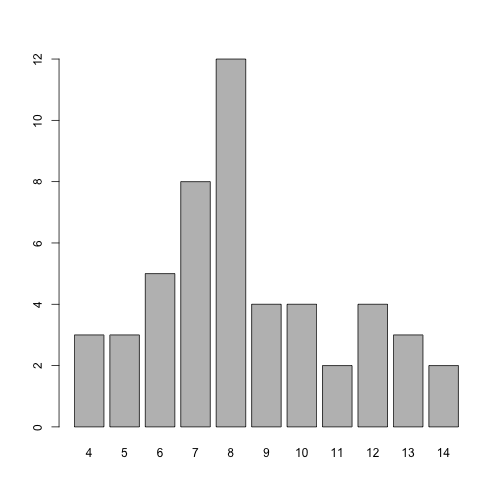
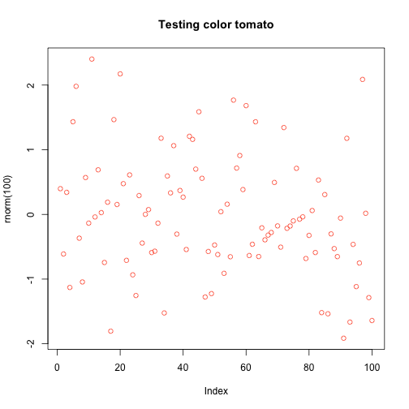

```r
x <- c(1,2,3,4,5)
y <- c(1,2,3,4,NA)
z <- c(TRUE,FALSE,TRUE)
w <- letters[1:5]
stat_range <- function(x) {
  max(x) - min(x)
}
stat_center <- function(x){
  c(mean(x), median(x))
}
stat_center(c(1,2,3,4))
```

```
## [1] 2.5 2.5
```

```r
stat_spreads <- function(x){
  c(stat_range(x), IQR(x), sd(x))
}
stat_spreads(c(1,2,3,4))
```

```
## [1] 3.000000 1.500000 1.290994
```


```r
source("functions.R")
context("Test for range value")
test_that("range works as expected", {
  x <- c(1, 2, 3, 4, 5)
  
  expect_equal(stat_range(x), 4)
  expect_length(stat_range(x), 1)
  expect_type(stat_range(x), 'double')
})

## Write more groups of tests -- test_that to test stat_range() with the rest of 
## testing vectors y, z, w
## Test vector y
context("Test for range value")
test_that("range works as expected", {
  y <- c(1, 2, 3, 4, NA)
  
  expect_length(stat_range(y), 1)
  expect_equal(stat_range(y), NA_real_)
})

## Test vector z
context("Test for range value")
test_that("range works as expected", {
  z <- c(TRUE, FALSE, TRUE)

  expect_length(stat_range(z), 1)
  expect_type(stat_range(z), 'integer')
  expect_equal(stat_range(z), 1L)
})

## Test vector q
context("Test for range value")
test_that("range works as expected", {
  w <- letters[1:5]
  
  expect_error(stat_range(w))
})
```


```r
head(USArrests)
```

```
##            Murder Assault UrbanPop Rape
## Alabama      13.2     236       58 21.2
## Alaska       10.0     263       48 44.5
## Arizona       8.1     294       80 31.0
## Arkansas      8.8     190       50 19.5
## California    9.0     276       91 40.6
## Colorado      7.9     204       78 38.7
```

```r
states <- rownames(USArrests)
head(states)
```

```
## [1] "Alabama"    "Alaska"     "Arizona"    "Arkansas"   "California"
## [6] "Colorado"
```

```r
nchar(states)
```

```
##  [1]  7  6  7  8 10  8 11  8  7  7  6  5  8  7  4  6  8  9  5  8 13  8  9
## [24] 11  8  7  8  6 13 10 10  8 14 12  4  8  6 12 12 14 12  9  5  4  7  8
## [47] 10 13  9  7
```

```r
tolower(states)
```

```
##  [1] "alabama"        "alaska"         "arizona"        "arkansas"      
##  [5] "california"     "colorado"       "connecticut"    "delaware"      
##  [9] "florida"        "georgia"        "hawaii"         "idaho"         
## [13] "illinois"       "indiana"        "iowa"           "kansas"        
## [17] "kentucky"       "louisiana"      "maine"          "maryland"      
## [21] "massachusetts"  "michigan"       "minnesota"      "mississippi"   
## [25] "missouri"       "montana"        "nebraska"       "nevada"        
## [29] "new hampshire"  "new jersey"     "new mexico"     "new york"      
## [33] "north carolina" "north dakota"   "ohio"           "oklahoma"      
## [37] "oregon"         "pennsylvania"   "rhode island"   "south carolina"
## [41] "south dakota"   "tennessee"      "texas"          "utah"          
## [45] "vermont"        "virginia"       "washington"     "west virginia" 
## [49] "wisconsin"      "wyoming"
```

```r
toupper(states)
```

```
##  [1] "ALABAMA"        "ALASKA"         "ARIZONA"        "ARKANSAS"      
##  [5] "CALIFORNIA"     "COLORADO"       "CONNECTICUT"    "DELAWARE"      
##  [9] "FLORIDA"        "GEORGIA"        "HAWAII"         "IDAHO"         
## [13] "ILLINOIS"       "INDIANA"        "IOWA"           "KANSAS"        
## [17] "KENTUCKY"       "LOUISIANA"      "MAINE"          "MARYLAND"      
## [21] "MASSACHUSETTS"  "MICHIGAN"       "MINNESOTA"      "MISSISSIPPI"   
## [25] "MISSOURI"       "MONTANA"        "NEBRASKA"       "NEVADA"        
## [29] "NEW HAMPSHIRE"  "NEW JERSEY"     "NEW MEXICO"     "NEW YORK"      
## [33] "NORTH CAROLINA" "NORTH DAKOTA"   "OHIO"           "OKLAHOMA"      
## [37] "OREGON"         "PENNSYLVANIA"   "RHODE ISLAND"   "SOUTH CAROLINA"
## [41] "SOUTH DAKOTA"   "TENNESSEE"      "TEXAS"          "UTAH"          
## [45] "VERMONT"        "VIRGINIA"       "WASHINGTON"     "WEST VIRGINIA" 
## [49] "WISCONSIN"      "WYOMING"
```

```r
casefold(states)
```

```
##  [1] "alabama"        "alaska"         "arizona"        "arkansas"      
##  [5] "california"     "colorado"       "connecticut"    "delaware"      
##  [9] "florida"        "georgia"        "hawaii"         "idaho"         
## [13] "illinois"       "indiana"        "iowa"           "kansas"        
## [17] "kentucky"       "louisiana"      "maine"          "maryland"      
## [21] "massachusetts"  "michigan"       "minnesota"      "mississippi"   
## [25] "missouri"       "montana"        "nebraska"       "nevada"        
## [29] "new hampshire"  "new jersey"     "new mexico"     "new york"      
## [33] "north carolina" "north dakota"   "ohio"           "oklahoma"      
## [37] "oregon"         "pennsylvania"   "rhode island"   "south carolina"
## [41] "south dakota"   "tennessee"      "texas"          "utah"          
## [45] "vermont"        "virginia"       "washington"     "west virginia" 
## [49] "wisconsin"      "wyoming"
```

```r
num_chars <- nchar(states)
char_freqs <- table(num_chars)
barplot(char_freqs)
```



```r
paste("Pumpkin", "Pie")
```

```
## [1] "Pumpkin Pie"
```

```r
paste0('Pumpkin', 'Pie')
```

```
## [1] "PumpkinPie"
```


```r
paste(states[1:5], num_chars[1:5], sep = " = ")
```

```
## [1] "Alabama = 7"     "Alaska = 6"      "Arizona = 7"     "Arkansas = 8"   
## [5] "California = 10"
```

```r
paste(states[1:5], collapse = '')
```

```
## [1] "AlabamaAlaskaArizonaArkansasCalifornia"
```

```r
substr(states, 1, 3)
```

```
##  [1] "Ala" "Ala" "Ari" "Ark" "Cal" "Col" "Con" "Del" "Flo" "Geo" "Haw"
## [12] "Ida" "Ill" "Ind" "Iow" "Kan" "Ken" "Lou" "Mai" "Mar" "Mas" "Mic"
## [23] "Min" "Mis" "Mis" "Mon" "Neb" "Nev" "New" "New" "New" "New" "Nor"
## [34] "Nor" "Ohi" "Okl" "Ore" "Pen" "Rho" "Sou" "Sou" "Ten" "Tex" "Uta"
## [45] "Ver" "Vir" "Was" "Wes" "Wis" "Wyo"
```

```r
substr(states, nchar(states) - 2, nchar(states))
```

```
##  [1] "ama" "ska" "ona" "sas" "nia" "ado" "cut" "are" "ida" "gia" "aii"
## [12] "aho" "ois" "ana" "owa" "sas" "cky" "ana" "ine" "and" "tts" "gan"
## [23] "ota" "ppi" "uri" "ana" "ska" "ada" "ire" "sey" "ico" "ork" "ina"
## [34] "ota" "hio" "oma" "gon" "nia" "and" "ina" "ota" "see" "xas" "tah"
## [45] "ont" "nia" "ton" "nia" "sin" "ing"
```

```r
paste(substr(states, 1, 1), substr(states, nchar(states) - 2, nchar(states)), sep = '')
```

```
##  [1] "Aama" "Aska" "Aona" "Asas" "Cnia" "Cado" "Ccut" "Dare" "Fida" "Ggia"
## [11] "Haii" "Iaho" "Iois" "Iana" "Iowa" "Ksas" "Kcky" "Lana" "Mine" "Mand"
## [21] "Mtts" "Mgan" "Mota" "Mppi" "Muri" "Mana" "Nska" "Nada" "Nire" "Nsey"
## [31] "Nico" "Nork" "Nina" "Nota" "Ohio" "Ooma" "Ogon" "Pnia" "Rand" "Sina"
## [41] "Sota" "Tsee" "Txas" "Utah" "Vont" "Vnia" "Wton" "Wnia" "Wsin" "Wing"
```

```r
states_list <- rep("", max(num_chars)-min(num_chars))
for (i in 1:length(states)){
  if (num_chars[i] %% 2 == 0){
    states[i] <- toupper(states[i])
  }else{
    states[i] <- tolower(states[i])
  }
}

for (i in min(num_chars):max(num_chars)){
  states_list[i - min(num_chars) + 1] <- 
    paste(states[num_chars == i], collapse = ", ")
}
states_list
```

```
##  [1] "IOWA, OHIO, UTAH"                                                                                                      
##  [2] "idaho, maine, texas"                                                                                                   
##  [3] "ALASKA, HAWAII, KANSAS, NEVADA, OREGON"                                                                                
##  [4] "alabama, arizona, florida, georgia, indiana, montana, vermont, wyoming"                                                
##  [5] "ARKANSAS, COLORADO, DELAWARE, ILLINOIS, KENTUCKY, MARYLAND, MICHIGAN, MISSOURI, NEBRASKA, NEW YORK, OKLAHOMA, VIRGINIA"
##  [6] "louisiana, minnesota, tennessee, wisconsin"                                                                            
##  [7] "CALIFORNIA, NEW JERSEY, NEW MEXICO, WASHINGTON"                                                                        
##  [8] "connecticut, mississippi"                                                                                              
##  [9] "NORTH DAKOTA, PENNSYLVANIA, RHODE ISLAND, SOUTH DAKOTA"                                                                
## [10] "massachusetts, new hampshire, west virginia"                                                                           
## [11] "NORTH CAROLINA, SOUTH CAROLINA"
```

```r
names(states_list) = c("4-chars", "5-chars", "6-chars", "7-chars", "8-chars", "9-chars",
                       "10-chars", "11-chars", "12-chars", "13-chars", "14-chars")
states_list
```

```
##                                                                                                                  4-chars 
##                                                                                                       "IOWA, OHIO, UTAH" 
##                                                                                                                  5-chars 
##                                                                                                    "idaho, maine, texas" 
##                                                                                                                  6-chars 
##                                                                                 "ALASKA, HAWAII, KANSAS, NEVADA, OREGON" 
##                                                                                                                  7-chars 
##                                                 "alabama, arizona, florida, georgia, indiana, montana, vermont, wyoming" 
##                                                                                                                  8-chars 
## "ARKANSAS, COLORADO, DELAWARE, ILLINOIS, KENTUCKY, MARYLAND, MICHIGAN, MISSOURI, NEBRASKA, NEW YORK, OKLAHOMA, VIRGINIA" 
##                                                                                                                  9-chars 
##                                                                             "louisiana, minnesota, tennessee, wisconsin" 
##                                                                                                                 10-chars 
##                                                                         "CALIFORNIA, NEW JERSEY, NEW MEXICO, WASHINGTON" 
##                                                                                                                 11-chars 
##                                                                                               "connecticut, mississippi" 
##                                                                                                                 12-chars 
##                                                                 "NORTH DAKOTA, PENNSYLVANIA, RHODE ISLAND, SOUTH DAKOTA" 
##                                                                                                                 13-chars 
##                                                                            "massachusetts, new hampshire, west virginia" 
##                                                                                                                 14-chars 
##                                                                                         "NORTH CAROLINA, SOUTH CAROLINA"
```


```r
## Temperature converting
to_celsius <- function(x = 1) {
  (x - 32) * (5/9)
}

to_kelvin <- function(x = 1) {
  (x + 459.67) * (5/9)
}

to_reaumur <- function(x = 1) {
  (x - 32) * (4/9)
}

to_rankine <- function(x = 1) {
  x + 459.67
}
temp_convert <- function(x = 1, to = "celsius") {
  to <- tolower(to)
  switch(to,
         "celsius" = to_celsius(x),
         "kelvin" = to_kelvin(x),
         "reaumur" = to_reaumur(x),
         "rankine" = to_rankine(x))
}

temp_convert(30, 'celsius')
```

```
## [1] -1.111111
```

```r
temp_convert(30, 'CELSIUS')
```

```
## [1] -1.111111
```

```r
temp_convert(30, 'Celsius')
```

```
## [1] -1.111111
```


```r
## Names of files (create 10 different files)
num <- 1:10
num <- as.character(num)
filename <- paste("file", num, sep = '')
filename <- paste(filename, "csv", sep = '.')
filename
```

```
##  [1] "file1.csv"  "file2.csv"  "file3.csv"  "file4.csv"  "file5.csv" 
##  [6] "file6.csv"  "file7.csv"  "file8.csv"  "file9.csv"  "file10.csv"
```

```r
## Rename
filename <- substr(filename, 5, nchar(filename))
filename <- paste("dataset", filename, sep = '')
```


```r
## Use function cat()
outfile <- "output.txt"

# writing to 'outfile.txt'
cat("This is the first line", file = outfile)
# insert new line
cat("\n", file = outfile, append = TRUE)
cat("A 2nd line", file = "output.txt", append = TRUE)
# insert 2 new lines
cat("\n\n", file = outfile, append = TRUE)
cat("\nThe quick brown fox jumps over the lazy dog\n",
    file = outfile, append = TRUE)
cat("---\n", file = outfile)
cat("title: \"lab09\"\n", file = outfile, append = TRUE)
cat("author: \"Betty Cui\"\n", file = outfile, append = TRUE)
cat("tdate: \"03/21/2018\"\n", file = outfile, append = TRUE)
cat("output: html_document\n", file = outfile, append = TRUE)
cat("---\n\n\n", file = outfile, append = TRUE)
cat("This is the first line", file = outfile, append = TRUE)
# insert new line
cat("\n", file = outfile, append = TRUE)
cat("A 2nd line", file = "output.txt", append = TRUE)
# insert 2 new lines
cat("\n\n", file = outfile, append = TRUE)
cat("\nThe quick brown fox jumps over the lazy dog\n",
    file = outfile, append = TRUE)
```


```r
## Plot with valid color
color <- colors()
is_color <- function(x){
  y <- FALSE
  for(i in 1:657){
    if(x == color[i]){
      y <- TRUE
    }
  }
  print(y)
}
is_color('yellow')
```

```
## [1] TRUE
```

```r
is_color('blu')
```

```
## [1] FALSE
```

```r
is_color('turkuoise')
```

```
## [1] FALSE
```

```r
colplot <- function(x){
  if(is_color(x) == FALSE){
    print(paste("invalid color", x, sep = " "))
  }else{
    plot(rnorm(100), col = x, main = paste("Testing color", x, sep = " ")) 
  }
}
colplot('tomato')
```

```
## [1] TRUE
```



```r
colplot("tomate")
```

```
## [1] FALSE
## [1] "invalid color tomate"
```


```r
## count vowels
set.seed(1)
letrs <- sample(letters, size = 100, replace = TRUE)
head(letrs)
```

```
## [1] "g" "j" "o" "x" "f" "x"
```

```r
# count the letters
countletter <- function(x){
  for (j in 1:length(x)){
    c <- 0
    for (i in 1:100){
      if (letrs[i] == x[j]){
        c <- c + 1
      }
    }
    d <- x[j]
    print(paste(d, c, sep = ": "))
  }
}
countletter(c("a", "e", "i", "o", "u"))
```

```
## [1] "a: 2"
## [1] "e: 2"
## [1] "i: 6"
## [1] "o: 2"
## [1] "u: 8"
```

```r
countletter(c("b", "c", "d", "f", "g", "h", "j", 
               "k", "l", "m", "n", "p", "q", "r", 
               "s", "t", "v", "w", "x", "y", "z" ))
```

```
## [1] "b: 3"
## [1] "c: 3"
## [1] "d: 3"
## [1] "f: 4"
## [1] "g: 6"
## [1] "h: 1"
## [1] "j: 5"
## [1] "k: 6"
## [1] "l: 4"
## [1] "m: 7"
## [1] "n: 2"
## [1] "p: 2"
## [1] "q: 5"
## [1] "r: 4"
## [1] "s: 5"
## [1] "t: 3"
## [1] "v: 4"
## [1] "w: 5"
## [1] "x: 4"
## [1] "y: 3"
## [1] "z: 1"
```

```r
count_letters <- function(x){
  v <- 0
  c <- 0
  for (j in 1:length(x)){
    if (letrs[j] == "a"|letrs[j] == "e"|letrs[j] == "i"|letrs[j] == "o"|letrs[j] == "u"){
      v <- v + 1
    }else{
      c <- c + 1
    }
  }
  print(paste(c("letters", "vowels", "constants"), c(length(x), v, c), sep = ": "))
}
count_letters(letrs)
```

```
## [1] "letters: 100"  "vowels: 20"    "constants: 80"
```
